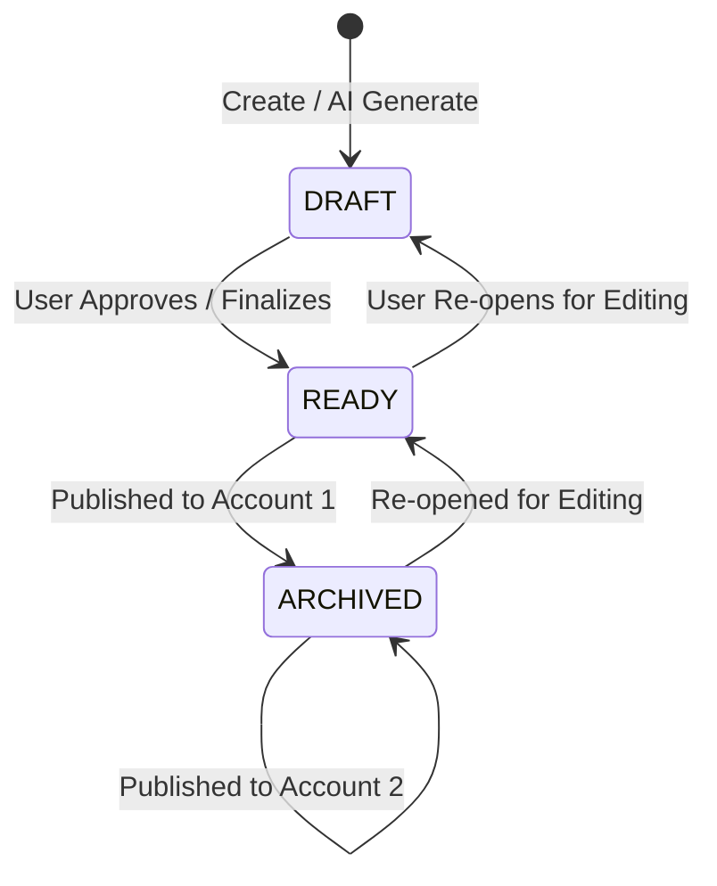
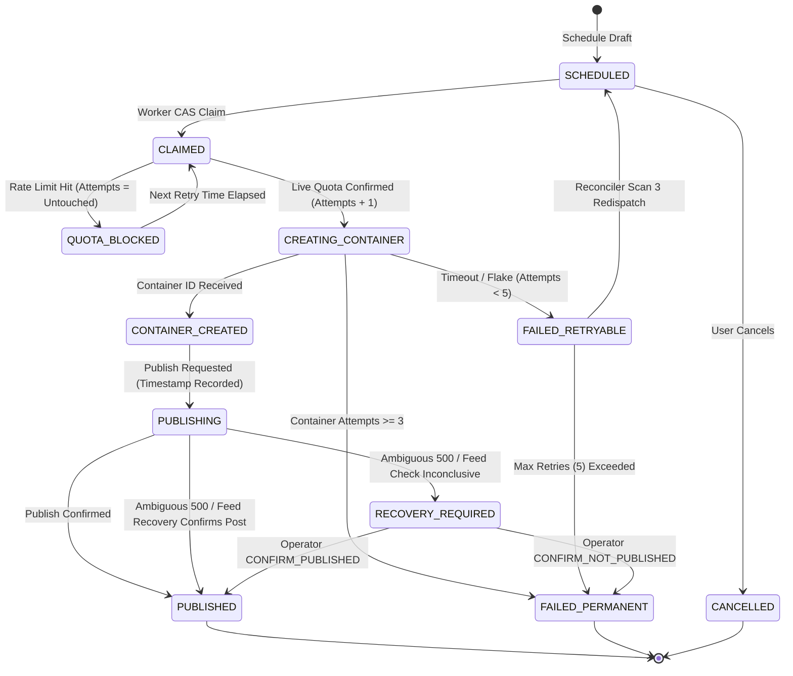
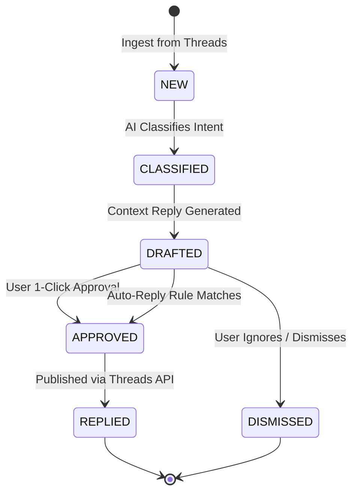

# FRD — ThreadPilot: Functional Requirements Document

**Product Name:** ThreadPilot  
**Document Version:** 1.0  
**Document Type:** Functional Requirements Document (FRD)  
**Status:** Living Engineering Specification & System Architecture Contract  
**Target Platform:** Web Application (Next.js 15) + REST API (NestJS 11) + Async Workers (BullMQ) + Meta Threads Graph API + Google Gemini AI + PostgreSQL with `pgvector`  

---

## 1. Engineering Architecture & System Contracts

### 1.1 Core Architectural Invariant
Every functional requirement in ThreadPilot operates under a strict separation of concerns across infrastructure layers:
- **PostgreSQL 16 (`@threadpilot/database`):** Authoritative source of truth for business entities, state machines, audit trails, and vector memory embeddings (`pgvector`).
- **BullMQ (`apps/worker`):** Durable, asynchronous execution engine running LangGraph agents, ingestion pipelines, and publishing workflows.
- **Redis (`apps/api` & `apps/worker`):** Short-term coordination, atomic distributed locking, rate-limit counters, and real-time Server-Sent Events (SSE) pub/sub streams.
- **Meta Threads Graph API (`@threadpilot/threads-client`):** External platform state. The system never assumes external operations succeed without authoritative confirmation.
- **Google Gemini 2.5 (`@threadpilot/ai`):** Stateless LLM intelligence and vector embeddings (`gemini-embedding-2`, 768 dimensions). The system does not rely on Gemini's server-side session history; PostgreSQL stores all memory.

### 1.2 Monorepo Package Topology
```
[apps/web] ──────(REST / SSE)──────> [apps/api]
                                        │
                         (BullMQ Jobs / Redis PubSub)
                                        ▼
                                  [apps/worker]
                                        │
           ┌────────────────────────────┼────────────────────────────┐
           ▼                            ▼                            ▼
  [@threadpilot/agents]        [@threadpilot/ai]         [@threadpilot/threads-client]
           │                            │                            │
           └────────────────────────────┼────────────────────────────┘
                                        ▼
                           [@threadpilot/database]
                           (PostgreSQL 16 + pgvector)
```

---

## 2. Comprehensive Functional Requirements

Requirements are organized chronologically by system phase and functional domain.

---

### Phase 1: Foundation, Voice Profile & Content Studio *(Implemented)*

#### FR-001: User Registration, Authentication & Password Hashing
- **Phase:** Phase 1 | **Status:** Implemented
- **Touchpoints:**
  - Controller: [`apps/api/src/auth/auth.controller.ts`](file:///d:/Projects/threads-automation/apps/api/src/auth/auth.controller.ts)
  - Service: [`apps/api/src/auth/auth.service.ts`](file:///d:/Projects/threads-automation/apps/api/src/auth/auth.service.ts), [`apps/api/src/auth/password.service.ts`](file:///d:/Projects/threads-automation/apps/api/src/auth/password.service.ts)
  - Models: `User`, `Workspace` in [`schema.prisma`](file:///d:/Projects/threads-automation/packages/database/prisma/schema.prisma)
- **Inputs:** `email` (RFC 5322), `password` (minimum 8 characters, upper/lower/number/symbol).
- **Processing Logic:**
  1. Validates unique email against `users` table.
  2. Hashes password using Argon2id with memory cost $65536$ KB, iterations $3$, parallelism $4$.
  3. Transactionally creates `User` and default personal `Workspace`.
  4. Returns signed JWT access token in response body and issues a rotating refresh token in an `HttpOnly`, `SameSite=Lax`, `Secure` cookie.
- **Outputs:** JWT payload `{ sub: userId, email, workspaceId, exp }` (15m expiration).

#### FR-002: Family-Based Refresh Token Rotation & Reuse Detection
- **Phase:** Phase 1 | **Status:** Implemented
- **Touchpoints:**
  - Service: [`apps/api/src/auth/refresh-token.service.ts`](file:///d:/Projects/threads-automation/apps/api/src/auth/refresh-token.service.ts)
  - Model: `RefreshToken` in [`schema.prisma`](file:///d:/Projects/threads-automation/packages/database/prisma/schema.prisma)
- **Inputs:** Cookie containing base64 refresh token string.
- **Processing Logic:**
  1. Compares presented token against Argon2id hash stored in `refresh_tokens`.
  2. If token is valid and unconsumed (`used_at IS NULL`): Marks `used_at = NOW()`, creates new `RefreshToken` record in same `family_id`, updates cookie.
  3. **Reuse Detection (Compromise Recovery):** If token presented has `used_at IS NOT NULL` (already used): Revokes all tokens sharing that `family_id` (`revoked_at = NOW()`), rejects request with `401 Unauthorized`, forces re-login.

#### FR-003: Multi-Tenant Workspace Tenancy Scoping
- **Phase:** Phase 1 | **Status:** Implemented
- **Touchpoints:**
  - Guards: [`apps/api/src/common/guards/workspace-scope.guard.ts`](file:///d:/Projects/threads-automation/apps/api/src/common/guards/workspace-scope.guard.ts)
  - Decorators: [`apps/api/src/common/decorators/workspace.decorator.ts`](file:///d:/Projects/threads-automation/apps/api/src/common/decorators/workspace.decorator.ts)
- **Processing Logic:**
  1. Every non-auth route requires `x-workspace-id` header or derives workspace from JWT claims.
  2. `WorkspaceScopeGuard` verifies the authenticated user owns or belongs to the target workspace.
  3. All database queries unconditionally include `WHERE workspace_id = :workspaceId`.

#### FR-004: Meta Threads OAuth 2.0 PKCE Authorization
- **Phase:** Phase 1 | **Status:** Implemented
- **Touchpoints:**
  - Service: [`packages/threads-client/src/threads-oauth.service.ts`](file:///d:/Projects/threads-automation/packages/threads-client/src/threads-oauth.service.ts)
  - Controller: [`apps/api/src/threads-auth/threads-auth.controller.ts`](file:///d:/Projects/threads-automation/apps/api/src/threads-auth/threads-auth.controller.ts)
- **Inputs:** Browser redirect to `/threads/authorize`.
- **Processing Logic:**
  1. Generates 43-to-128 char cryptographic `code_verifier` and SHA-256 base64url-encoded `code_challenge`.
  2. Stores `code_verifier` in Redis keyed by state UUID with 10-minute TTL.
  3. Redirects user to Meta OAuth endpoint with requested scopes: `threads_basic`, `threads_content_publish`.
  4. On callback (`/threads/callback`): Exchanges authorization code and `code_verifier` for short-lived token, then exchanges for 60-day long-lived token.

#### FR-005: Versioned AES-256-GCM Token Encryption & Auto-Refresh
- **Phase:** Phase 1 | **Status:** Implemented
- **Touchpoints:**
  - Service: [`packages/threads-client/src/token-encryption.service.ts`](file:///d:/Projects/threads-automation/packages/threads-client/src/token-encryption.service.ts), [`packages/threads-client/src/token.service.ts`](file:///d:/Projects/threads-automation/packages/threads-client/src/token.service.ts)
  - Processor: [`apps/worker/src/processors/token-refresh.processor.ts`](file:///d:/Projects/threads-automation/apps/worker/src/processors/token-refresh.processor.ts)
- **Processing Logic:**
  1. Encrypts tokens using AES-256-GCM with a random 12-byte IV and 16-byte authentication tag.
  2. Stores payload formatted as: `{keyVersion}:{base64(iv + authTag + ciphertext)}`.
  3. Key rotation allows incrementing `TOKEN_ENCRYPTION_KEY_VERSION` without invalidating existing stored tokens.
  4. Worker cron evaluates tokens daily: any token expiring in $< 30$ days is refreshed via Meta's `GET /refresh_access_token`.

#### FR-006: Historical Post Ingestion & Normalization
- **Phase:** Phase 1 | **Status:** Implemented
- **Touchpoints:**
  - Processor: [`apps/worker/src/processors/ingestion.processor.ts`](file:///d:/Projects/threads-automation/apps/worker/src/processors/ingestion.processor.ts)
  - Models: `ExternalPost`, `ThreadPost` in [`schema.prisma`](file:///d:/Projects/threads-automation/packages/database/prisma/schema.prisma)
- **Processing Logic:**
  1. Traverses Meta `GET /me/threads` with cursor pagination.
  2. Stores immutable raw JSON payload in `external_posts`.
  3. Normalizes text and timestamp into canonical `thread_posts` (`sourceType = 'INGESTED'`, `isOurs = true`).
  4. Automatically enqueues `StyleProcessor` and `EmbeddingProcessor` jobs.

#### FR-007: 8-Point Stylometric Feature Extraction
- **Phase:** Phase 1 | **Status:** Implemented
- **Touchpoints:**
  - Graph: [`packages/agents/src/profile/style-extraction.graph.ts`](file:///d:/Projects/threads-automation/packages/agents/src/profile/style-extraction.graph.ts)
  - Processor: [`apps/worker/src/processors/style.processor.ts`](file:///d:/Projects/threads-automation/apps/worker/src/processors/style.processor.ts)
  - Model: `UserProfile` in [`schema.prisma`](file:///d:/Projects/threads-automation/packages/database/prisma/schema.prisma)
- **Extracted Metrics:**
  - `avgPostLengthChars`: Mean character length of posts.
  - `avgSentenceLengthWords`: Average words per sentence.
  - `questionFrequency`: Percentage of posts featuring questions ($0.0 - 1.0$).
  - `emojiFrequency`: Percentage of posts containing emojis.
  - `firstPersonFrequency`: Rate of first-person pronouns ("I", "me", "my").
  - `technicalVocabScore`: Frequency of domain-specific technical vocabulary.
  - `listUsageFrequency`: Percentage of posts formatted as lists.
  - `contraryHookFrequency`: Rate of contrarian or pattern-interrupt openings.
- **Output:** Updates `user_profiles` and creates versioned `style_profile_snapshots`.

#### FR-008: Multi-Representation pgvector Vector Memory
- **Phase:** Phase 1 | **Status:** Implemented
- **Touchpoints:**
  - Repository: [`packages/database/src/memory.repository.ts`](file:///d:/Projects/threads-automation/packages/database/src/memory.repository.ts)
  - Models: `MemoryItem`, `MemoryEmbedding` in [`schema.prisma`](file:///d:/Projects/threads-automation/packages/database/prisma/schema.prisma)
- **Processing Logic:**
  1. Posts are embedded via Google Gemini `gemini-embedding-2` (768 dimensions).
  2. Embeddings are stored in `memory_embeddings` with explicit `task_type`:
     - `DOCUMENT`: Used for semantic exemplar retrieval during drafting.
     - `SIMILARITY`: Used for duplicate detection.
  3. Retrieval executes cosine distance matching via raw PostgreSQL SQL:
     ```sql
     SELECT m.*, (1 - (e.embedding <=> $1::vector)) AS similarity
     FROM memory_items m
     JOIN memory_embeddings e ON e.memory_item_id = m.id
     WHERE m.workspace_id = $2 AND e.task_type = 'DOCUMENT'
     ORDER BY e.embedding <=> $1::vector ASC
     LIMIT $3;
     ```

#### FR-009: Content Idea Generation
- **Phase:** Phase 1 | **Status:** Implemented
- **Touchpoints:**
  - Graph: [`packages/agents/src/content/content.graph.ts`](file:///d:/Projects/threads-automation/packages/agents/src/content/content.graph.ts)
  - Model: `ContentIdea` in [`schema.prisma`](file:///d:/Projects/threads-automation/packages/database/prisma/schema.prisma)
- **Inputs:** Workspace profile, preferred topics, historical high-performing exemplars.
- **Outputs:** Creates `ContentIdea` records containing `title`, `concept`, `reason`, `format`, `topic`, and `confidence` score ($0.0 - 1.0$).

#### FR-010: Multi-Turn LangGraph Content Drafting
- **Phase:** Phase 1 | **Status:** Implemented
- **Touchpoints:**
  - Graph: [`packages/agents/src/content/content.graph.ts`](file:///d:/Projects/threads-automation/packages/agents/src/content/content.graph.ts)
  - Processor: [`apps/worker/src/processors/content.processor.ts`](file:///d:/Projects/threads-automation/apps/worker/src/processors/content.processor.ts)
- **Workflow Steps:**
  1. `load_memory`: Queries vector memory for top 3 exemplars matching the topic.
  2. `generate_initial`: Generates candidate post using few-shot exemplar injection.
  3. `evaluate_draft`: Analyzes hook strength, cadence, and tone consistency.
  4. `refine_draft`: Rewrites draft to maximize punchiness and eliminate filler.
  5. `validate_final`: Strict deterministic validation gate (see FR-011).

#### FR-011: Deterministic 500-Character Final Validation Gate
- **Phase:** Phase 1 | **Status:** Implemented
- **Touchpoints:**
  - Node: `validateFinal` in [`packages/agents/src/content/content.graph.ts`](file:///d:/Projects/threads-automation/packages/agents/src/content/content.graph.ts)
- **Validation Rules:**
  - Length must be $\le 500$ UTF-16 code units (Meta hard limit).
  - Body must not be empty or whitespace-only.
  - Body must not contain markdown code block delimiters (` ``` `) or LLM placeholder tokens (`[Insert Link]`, `TODO`).
  - If validation fails, node automatically truncates or triggers a targeted one-shot compression prompt.

#### FR-012: Version History & Diff Summarization
- **Phase:** Phase 1 | **Status:** Implemented
- **Touchpoints:**
  - Model: `ContentVersion` in [`schema.prisma`](file:///d:/Projects/threads-automation/packages/database/prisma/schema.prisma)
  - Component: [`apps/web/src/components/editor/VersionHistory.tsx`](file:///d:/Projects/threads-automation/apps/web/src/components/editor/VersionHistory.tsx)
- **Processing Logic:**
  - Every AI improvement or manual save increments `version` number on `content_versions`.
  - Computes and stores `diffSummary` comparing version $N$ against version $N-1$.
  - Allows full roll-back to any historical version.

#### FR-013: Server-Sent Events (SSE) Job Progress Streaming
- **Phase:** Phase 1 | **Status:** Implemented
- **Touchpoints:**
  - API Controller: [`apps/api/src/jobs/jobs.controller.ts`](file:///d:/Projects/threads-automation/apps/api/src/jobs/jobs.controller.ts)
  - Service: [`apps/worker/src/services/job-progress.service.ts`](file:///d:/Projects/threads-automation/apps/worker/src/services/job-progress.service.ts)
  - Hook: [`apps/web/src/hooks/useJobProgress.ts`](file:///d:/Projects/threads-automation/apps/web/src/hooks/useJobProgress.ts)
- **Processing Logic:**
  - Workers emit job lifecycle events (`QUEUED` $\rightarrow$ `LOADING_MEMORY` $\rightarrow$ `GENERATING` $\rightarrow$ `EVALUATING` $\rightarrow$ `PERSISTING` $\rightarrow$ `COMPLETE`) via Redis PubSub on channel `job-progress:{requestId}`.
  - API exposes `GET /jobs/:id/events` which subscribes to Redis channel and streams SSE frames to the frontend client.

---

### Phase 2: Resilient Scheduled Publishing Pipeline *(Implemented)*

#### FR-014: Multi-Account Draft Scheduling & Lifecycle Reuse
- **Phase:** Phase 2 | **Status:** Implemented
- **Touchpoints:**
  - Service: [`apps/api/src/content/content.service.ts`](file:///d:/Projects/threads-automation/apps/api/src/content/content.service.ts)
  - Model: `ScheduledPost`, `PublishedPost` in [`schema.prisma`](file:///d:/Projects/threads-automation/packages/database/prisma/schema.prisma)
- **Processing Logic:**
  1. `scheduleDraft()` accepts drafts with `status = 'READY'` or `status = 'ARCHIVED'`.
  2. Verifies draft has not already been published to target account:
     ```typescript
     const exists = await db.publishedPost.findUnique({
       where: { draftId_socialAccountId: { draftId, socialAccountId } }
     });
     if (exists) throw new ConflictException('Already published to this account');
     ```
  3. Ensures no active schedule exists for `(draftId, socialAccountId)` via partial index `idx_scheduled_posts_active_draft`.
  4. Pins `content_version_id`, `content_snapshot`, `content_hash`, and computed `request_fingerprint`.

#### FR-015: Transactional Outbox Pattern for Queue Resilience
- **Phase:** Phase 2 | **Status:** Implemented
- **Touchpoints:**
  - Processor: `EventOutboxProcessor`, `ScheduledPostDispatch`
  - Migration: `0006_scheduled_publishing_fsm/migration.sql`
- **Processing Logic:**
  1. When a post is scheduled, an outbox row `scheduled_post_dispatches` is transactionally inserted with `status = 'PENDING'`.
  2. Redis enqueue occurs asynchronously. If Redis is down, dispatch remains `PENDING`.
  3. Reconciliation Scan 1 periodically sweeps pending dispatches and pushes missing jobs to BullMQ.

#### FR-016: Fenced Worker CAS Execution Claiming
- **Phase:** Phase 2 | **Status:** Implemented
- **Touchpoints:**
  - Processor: `PublishingProcessor`
- **Processing Logic:**
  1. Worker executes atomic compare-and-swap (CAS) via raw SQL:
     ```sql
     WITH claimed AS (
       SELECT id, status AS previous_status
       FROM scheduled_posts
       WHERE id = $1
         AND status IN ('SCHEDULED', 'FAILED_RETRYABLE', 'QUOTA_BLOCKED')
         AND (lease_until IS NULL OR lease_until <= NOW())
       FOR UPDATE SKIP LOCKED
     )
     UPDATE scheduled_posts sp
     SET status = 'CLAIMED',
         claimed_by = $2,
         claimed_at = NOW(),
         lease_until = NOW() + INTERVAL '3 minutes',
         attempt_id = gen_random_uuid()
     FROM claimed c
     WHERE sp.id = c.id
     RETURNING sp.*, c.previous_status;
     ```
  2. If 0 rows are returned, claim failed (another worker acquired or schedule was cancelled). Worker exits without side effects.

#### FR-017: Pre-Execution Quota Gate & Attempt Count Isolation
- **Phase:** Phase 2 | **Status:** Implemented
- **Processing Logic:**
  1. Worker inspects Meta rate limits prior to container creation.
  2. If platform quota is exhausted:
     - Updates `status = 'QUOTA_BLOCKED'`, `next_retry_at = NOW() + 15m`, `last_quota_checked_at = NOW()`.
     - **Attempt count invariant:** Leaves `attempt_count` untouched. Quota checks never consume execution attempts.
  3. Only when live quota is verified does the worker increment `attempt_count = attempt_count + 1`.

#### FR-018: Two-Stage Threads Publishing & Polling FSM
- **Phase:** Phase 2 | **Status:** Implemented
- **Processing Logic:**
  1. Step 4: Calls `POST /me/threads` (`media_type: 'TEXT_POST'`, `text: canonicalBody`). Persists returned `container_id`, transitions to `CONTAINER_CREATED`.
  2. Step 5: Polls `GET /{container_id}?fields=status,error_message` every 2 seconds for up to 30 seconds.
     - `FINISHED`: Proceeds immediately to Step 7 (Publish Commit).
     - `IN_PROGRESS`: Continues polling within budget.
     - `EXPIRED`: Transitions to `FAILED_RETRYABLE` (or `FAILED_PERMANENT` if attempt $\ge 5$).
     - `ERROR`: Fails permanently if non-ambiguous.

#### FR-019: 45-Second Ambiguous Publish Protocol & Feed Recovery
- **Phase:** Phase 2 | **Status:** Implemented
- **Trigger:** Network timeout or HTTP 500/502/504 during `POST /me/threads_publish`.
- **Processing Logic:**
  1. Variable `hasPublishAmbiguity` declared in outer scope; set to `true` immediately before publish call.
  2. Queries user's recent feed (`GET /me/threads?limit=10`).
  3. Evaluates posts created within $\pm 4$ minutes of `publish_requested_at`.
  4. Candidate matching criteria:
     - `p.text === canonicalBody`
     - `p.media_type === 'TEXT_POST'`
     - `sha256(canonicalOutboundText(p.text)) === content_hash`
  5. If exactly 1 matching post is found: Adopts `threads_post_id`, marks `PUBLISHED`.
  6. If 0 or $>1$ candidate found: Transitions to `RECOVERY_REQUIRED` with high-priority admin notification. Never re-publishes blindly.

#### FR-020: Background Watchdog Reconciliation (Scans 1 to 6)
- **Phase:** Phase 2 | **Status:** Implemented
- **Touchpoints:**
  - Service: `PublishingReconciliationService`
- **Reconciliation Scans:**
  - **Scan 1 (Outbox Recovery):** Finds `PENDING` dispatches $> 30$s old; enqueues to BullMQ; marks `DISPATCHED`.
  - **Scan 2 (Due Schedule Watchdog):** Finds `SCHEDULED` posts due within 5m missing from BullMQ; re-dispatches.
  - **Scan 3 (Retry Scanner):** Finds `FAILED_RETRYABLE` posts where `next_retry_at <= NOW()`; redispatches.
  - **Scan 4 (Stale Lease Reclaimer):** Finds `CLAIMED` / `PUBLISHING` posts where `lease_until < NOW()`; reclaims or expires.
  - **Scan 5 (Platform Timestamp Backfill):** Scans `PUBLISHED` posts where `published_at IS NULL`; fetches platform timestamp via `getPost()`; strictly joins on `pp.draft_id = sp.draft_id AND pp.social_account_id = sp.social_account_id`; updates `scheduled_posts`, `published_posts`, and `thread_posts`.
  - **Scan 6 (Outbox Event Reclaim):** Reclaims stale `PROCESSING` events in `event_outbox`.

#### FR-021: Manual Operator Resolution Interface
- **Phase:** Phase 2 | **Status:** Implemented
- **Touchpoints:**
  - Endpoints: `POST /schedules/:id/resolve` (`CONFIRM_PUBLISHED` or `CONFIRM_NOT_PUBLISHED`)
- **Processing Logic:**
  - `CONFIRM_PUBLISHED`: Validates target Threads post exists, is owned by user, and has `media_type === 'TEXT_POST'`. Atomically marks `PUBLISHED`, writes `PublishedPost`, upserts `ThreadPost`, archives draft.
  - `CONFIRM_NOT_PUBLISHED`: Verifies container status is in allowlist (`FINISHED`, `ERROR`, `EXPIRED`). Cancels container, sets schedule to `FAILED_PERMANENT`.

---

### Phase 3: Engagement Engine & Conversational Intelligence *(Next Phase)*

#### FR-022: Interaction Ingestion (Replies, Quotes & Mentions)
- **Phase:** Phase 3 | **Status:** Roadmap
- **Processing Logic:**
  1. Worker cron queries Meta `GET /me/threads?fields=id,text,timestamp` and `GET /{threads_post_id}/conversation`.
  2. Deduplicates incoming messages against `interactions` table using `external_interaction_id`.
  3. Stores full conversation thread context for hierarchical evaluation.

#### FR-023: Interaction Classification State Machine
- **Phase:** Phase 3 | **Status:** Roadmap
- **Classification Categories:**
  - `QUESTION`: Queries seeking information or clarification.
  - `AGREEMENT`: Supportive remarks, validation, agreement.
  - `DISAGREEMENT`: Counter-arguments, critical questions, objections.
  - `COMPLIMENT`: Praise, gratitude, appreciation.
  - `REQUEST`: Feature requests, collaboration inquiries, direct asks.
  - `TROLLING`: Insults, bad-faith attacks, inflammatory remarks.
  - `SPAM`: Self-promotion, crypto shilling, automated links.
  - `UNCLEAR`: Ambiguous context, single emoji reactions.
- **Output:** Writes classification, priority score ($1-10$), and `requires_response` boolean to `interactions`.

#### FR-024: Context-Aware Reply Generation
- **Phase:** Phase 3 | **Status:** Roadmap
- **Inputs:** Parent post text, incoming reply text, author positioning, conversation history, user disagreement policy.
- **Processing Logic:**
  1. Evaluates user's `disagreement_style` from profile (e.g., *conciliatory*, *technical/empirical*, *firm/direct*).
  2. Injects author's persona guidelines (never get defensive, prioritize clarity, keep replies concise).
  3. Produces candidate reply stored in `reply_drafts` with confidence score.

#### FR-025: Human-in-the-Loop Review Queue Interface
- **Phase:** Phase 3 | **Status:** Roadmap
- **UI Components:** In `apps/web/src/app/(dashboard)/engagement`:
  - Card deck or list view displaying incoming comment + generated reply.
  - 1-Click Actions: `Approve & Publish`, `Edit & Publish`, `Regenerate`, `Dismiss`.
  - User edits are persisted to a dataset of fine-tuning exemplars for reply learning.

#### FR-026: Conditional Auto-Reply Rules & Safety Filters
- **Phase:** Phase 3 | **Status:** Roadmap
- **Processing Logic:**
  - Auto-reply only executes if `user_preferences.autonomy_replies === 'RULES_BASED'`.
  - Allowed categories: `QUESTION`, `COMPLIMENT` with confidence $> 0.90$.
  - Hard Exclusions: If interaction is classified as `DISAGREEMENT`, `TROLLING`, or contains flagged political/sensitive keywords, auto-reply is suppressed and routed to human review.

---

### Phase 4: Performance Analytics & Intelligence Loop *(Future Phase)*

#### FR-027: Platform Metrics Synchronization
- **Phase:** Phase 4 | **Status:** Roadmap
- **Processing Logic:**
  1. Worker cron queries Meta Insights API for all published posts created in the last 30 days.
  2. Metrics fetched: `views`, `likes`, `replies`, `reposts`, `quotes`.
  3. Appends historical snapshot to `post_metrics` for longitudinal trend analysis.

#### FR-028: Multi-Dimensional Performance Aggregation
- **Phase:** Phase 4 | **Status:** Roadmap
- **Aggregated Dimensions:**
  - **Topic Level:** Average engagement rate per topic (e.g. AI vs Cloud vs Careers).
  - **Format Level:** Average reach by format (one-liners, tutorials, personal stories).
  - **Hook Style Level:** Performance of contrarian openings vs question openings.
  - **Temporal Level:** Heatmap of reach by day of week and hour of day.

#### FR-029: AI Correlation Insights Generation
- **Phase:** Phase 4 | **Status:** Roadmap
- **Processing Logic:**
  1. AI analyzes performance differentials across stylometric clusters.
  2. Generates structured insights with statistical backing:
     ```json
     {
       "observation": "Contrarian hook patterns generated 34% more replies than standard questions",
       "sample_size": 18,
       "confidence": 0.88,
       "recommendation": "Incorporate contrarian opening hooks for technical debate topics"
     }
     ```
  3. Guardrail: Labels correlations strictly as *observed trends*, never as guaranteed outcomes.

#### FR-030: Performance-Driven Content Recommendations
- **Phase:** Phase 4 | **Status:** Roadmap
- **Processing Logic:**
  - Feeds empirical high-performing topics and formats into `ContentIdea` generator.
  - Dynamically updates topic weights in `user_preferences`.

---

### Phase 5: Autonomous Social Operator & Experiments *(Future Phase)*

#### FR-031: Dynamic Automation Rules Engine
- **Phase:** Phase 5 | **Status:** Roadmap
- **DSL Structure:** Evaluates conditional rules defined by user:
  ```
  IF topic IN ('AI', 'Architecture')
  AND confidence >= 0.92
  AND risk_score == 'LOW'
  AND daily_publish_count < 2
  THEN AUTO_SCHEDULE(next_available_slot)
  ```

#### FR-032: Pre-Publish Safety Gate & Policy Verification
- **Phase:** Phase 5 | **Status:** Roadmap
- **Verification Gates:**
  1. **Hallucination / Personal Claim Check:** Flag any post claiming first-person factual achievements not verified in `user_profile`.
  2. **Controversy / Sentiment Filter:** Screen against sensitive topic blacklists.
  3. **Platform Rate Guard:** Verify rolling 24-hour post count is $< 200$ (well below Meta's 250 limit).

#### FR-033: Native A/B Content Experimentation
- **Phase:** Phase 5 | **Status:** Roadmap
- **Processing Logic:**
  1. User configures an experiment (e.g., Hook A: Direct Statement vs Hook B: Contrarian Question).
  2. System alternates variants across scheduled posts over a 14-day window.
  3. Reports statistical comparison across reach, completion, and reply rate.

#### FR-034: Continuous Profile Adaptation Loop
- **Phase:** Phase 5 | **Status:** Roadmap
- **Processing Logic:**
  - Evaluates quarterly stylometric shift.
  - Proposes refined baseline metrics (e.g. increasing `avgPostLengthChars` from 280 to 340) for user confirmation.

---

## 3. Database Schema Specification

### Current Schema Models (`packages/database/prisma/schema.prisma`)
| Model | Primary Key | Key Fields | Purpose |
|---|---|---|---|
| `User` | UUID | `email`, `passwordHash` | Master user identity |
| `RefreshToken` | UUID | `userId`, `familyId`, `tokenHash`, `usedAt`, `revokedAt` | Family-based refresh token rotation |
| `Workspace` | UUID | `userId`, `name` | Multi-tenant scoping boundary |
| `SocialAccount` | UUID | `workspaceId`, `platform`, `externalId`, `username` | Threads account connection |
| `OAuthToken` | UUID | `socialAccountId`, `accessTokenEncrypted`, `expiresAt` | Versioned AES-256-GCM tokens |
| `UserProfile` | UUID | `workspaceId`, 8 stylometric indicators, `profileVersion` | Stylometric voice definition |
| `StyleProfileSnapshot` | UUID | `workspaceId`, `version`, `features` | Immutable style profile snapshots |
| `UserPreferences` | UUID | `workspaceId`, `preferredTopics`, `autonomyPublishing` | User controls & autonomy settings |
| `MemoryItem` | UUID | `workspaceId`, `type`, `content`, `sourceId` | Authoritative vector memory entity |
| `MemoryEmbedding` | UUID | `memoryItemId`, `model`, `dimensions`, `taskType` | pgvector 768-dim coordinates |
| `ContentIdea` | UUID | `workspaceId`, `title`, `concept`, `topic`, `confidence` | Discovered topical opportunities |
| `ContentDraft` | UUID | `workspaceId`, `ideaId`, `status` (`DRAFT`/`READY`/`ARCHIVED`) | Authoring draft entity |
| `ContentVersion` | UUID | `draftId`, `version`, `body`, `hook`, `diffSummary` | Immutable draft versions |
| `ScheduledPost` | UUID | `draftId`, `socialAccountId`, `status`, `leaseUntil` | Publishing pipeline state machine |
| `PublishedPost` | UUID | `draftId`, `socialAccountId`, `threadsPostId`, `publishedAt` | Authoritative published record |
| `ThreadPost` | UUID | `socialAccountId`, `threadsPostId`, `sourceType`, `isOurs` | Normalized canonical Threads post |
| `JobRecord` | UUID | `workspaceId`, `requestId`, `type`, `status`, `progress` | Background BullMQ job tracking |
| `PlatformRateLimit` | UUID | `socialAccountId`, `category`, `limitValue`, `remaining` | Meta 24-hour rate limit tracker |
| `AgentRun` | UUID | `workspaceId`, `workflowId`, `inputHash`, `totalCostUsd` | LangGraph execution audit trail |
| `AgentAction` | UUID | `runId`, `capability`, `input`, `output`, `result` | Discrete step within agent run |
| `AIUsage` | UUID | `workspaceId`, `provider`, `model`, `inputTokens`, `cost` | LLM token usage accounting |
| `Notification` | UUID | `workspaceId`, `type`, `title`, `body`, `idempotencyKey` | User alerts and notifications |
| `AuditLog` | UUID | `workspaceId`, `action`, `entityType`, `entityId` | Immutable security audit log |

### Phase 2 Publishing Models
- `ScheduledPostDispatch`: Outbox dispatch tracking (`id`, `scheduledPostId`, `status`, `dispatchedAt`).
- `EventOutbox`: Decoupled notification events with lease fencing (`id`, `workspaceId`, `eventType`, `payload`, `status`, `leaseToken`).
- `scheduled_posts_migration_quarantine`: Standalone quarantine table for conflicting pre-migration recovery rows.

### Phase 3–5 Roadmap Models
- `Interaction`: Ingested comments and mentions (`id`, `socialAccountId`, `threadPostId`, `authorUsername`, `content`, `classification`, `sentiment`, `status`).
- `ReplyDraft`: AI-generated reply candidate (`id`, `interactionId`, `body`, `confidence`, `approvalStatus`).
- `PostMetric`: Time-series analytics snapshots (`id`, `threadPostId`, `views`, `likes`, `replies`, `reposts`, `capturedAt`).
- `Insight`: Extracted statistical observations (`id`, `workspaceId`, `observation`, `confidence`, `sampleSize`, `recommendation`).
- `Experiment`: A/B testing campaign (`id`, `workspaceId`, `hypothesis`, `variantA`, `variantB`, `status`, `metrics`).
- `AutomationRule`: User-defined autonomy rule (`id`, `workspaceId`, `conditionsJson`, `actionJson`, `isActive`).

---

## 4. State Machine Specifications

### 4.1 ContentDraft Lifecycle


### 4.2 ScheduledPost Publishing Lifecycle


### 4.3 Interaction Review Lifecycle (Phase 3)


---

## 5. Non-Functional Requirements (NFRs)

| NFR ID | Category | Requirement | Verification Protocol |
|---|---|---|---|
| **NFR-001** | **API Latency** | Standard dashboard endpoints respond in $< 300$ ms ($p95 < 500$ ms). | Automated load testing (`autocannon`) |
| **NFR-002** | **Publishing Idempotency** | Exactly one external publish request executed per attempt. Zero duplicate Threads posts under network partition. | E2E mock network drop test suite |
| **NFR-003** | **Credential Security** | Zero plain-text OAuth tokens stored in database or logs. Client access tokens stored exclusively in browser memory. | Automated static security AST scan |
| **NFR-004** | **Vector Memory Purity** | All embeddings maintain uniform 768 dimensions under `gemini-embedding-2`. Coordinate spaces never mixed. | Database dimension check constraints |
| **NFR-005** | **Observability** | All agent runs trace input hash, output hash, latency, tokens, and USD cost. | Audit verification via `AgentRun` table |
| **NFR-006** | **Platform Compliance** | Strict hard ceiling of 500 characters per post enforced before database commit or API call. | Unit tests in `content.graph.spec.ts` |

---

## 6. Implementation Traceability Matrix

| Requirement | Domain / Phase | Primary Source Files | Primary Spec / Test Files |
|---|---|---|---|
| **FR-001** | Auth / Phase 1 | `apps/api/src/auth/auth.service.ts` | `apps/api/test/auth.spec.ts` |
| **FR-002** | Auth / Phase 1 | `apps/api/src/auth/refresh-token.service.ts` | `apps/api/test/token-rotation.spec.ts` |
| **FR-004** | OAuth / Phase 1 | `packages/threads-client/src/threads-oauth.service.ts` | `packages/threads-client/test/oauth-negative-paths.spec.ts` |
| **FR-005** | Security / Phase 1 | `packages/threads-client/src/token-encryption.service.ts` | `packages/threads-client/test/encryption.spec.ts` |
| **FR-006** | Ingestion / Phase 1 | `apps/worker/src/processors/ingestion.processor.ts` | `apps/worker/test/ingestion-interruption.spec.ts` |
| **FR-007** | Voice Profile / Phase 1 | `packages/agents/src/profile/style-extraction.graph.ts` | `apps/worker/test/style-extraction.spec.ts` |
| **FR-008** | Memory / Phase 1 | `packages/database/src/memory.repository.ts` | `packages/database/test/real-pgvector-duplicate.spec.ts` |
| **FR-010** | Drafting / Phase 1 | `packages/agents/src/content/content.graph.ts` | `apps/worker/test/content-generation.spec.ts` |
| **FR-011** | Validation / Phase 1 | `packages/agents/src/content/content.graph.ts` | `packages/agents/test/validation-gate.spec.ts` |
| **FR-013** | Streaming / Phase 1 | `apps/worker/src/services/job-progress.service.ts` | `apps/web/src/hooks/useJobProgress.ts` |
| **FR-014** | Scheduling / Phase 2 | `apps/api/src/content/content.service.ts` | `apps/api/test/content-scheduling.spec.ts` |
| **FR-016** | Fenced Claim / Phase 2 | `apps/worker/src/processors/publishing.processor.ts` | `apps/worker/test/fenced-claim.spec.ts` |
| **FR-017** | Quota Gate / Phase 2 | `apps/worker/src/processors/publishing.processor.ts` | `apps/worker/test/quota-isolation.spec.ts` |
| **FR-018** | Publishing / Phase 2 | `apps/worker/src/services/publishing.service.ts` | `apps/worker/test/container-lifecycle.spec.ts` |
| **FR-019** | Ambiguity / Phase 2 | `apps/worker/src/processors/publishing.processor.ts` | `apps/worker/test/ambiguous-recovery.spec.ts` |
| **FR-020** | Reconciler / Phase 2 | `apps/worker/src/processors/publishing-reconciliation.service.ts` | `apps/worker/test/reconciliation-scans.spec.ts` |
| **FR-022** | Engagement / Phase 3 | `apps/worker/src/processors/engagement.processor.ts` *(Roadmap)* | `apps/worker/test/engagement-ingest.spec.ts` |
| **FR-023** | Classification / Phase 3 | `packages/agents/src/engagement/classifier.graph.ts` *(Roadmap)* | `packages/agents/test/classifier.spec.ts` |
| **FR-027** | Analytics / Phase 4 | `apps/worker/src/processors/analytics.processor.ts` *(Roadmap)* | `apps/worker/test/analytics-sync.spec.ts` |
| **FR-031** | Autonomy / Phase 5 | `apps/worker/src/services/rules-engine.service.ts` *(Roadmap)* | `apps/worker/test/rules-engine.spec.ts` |
