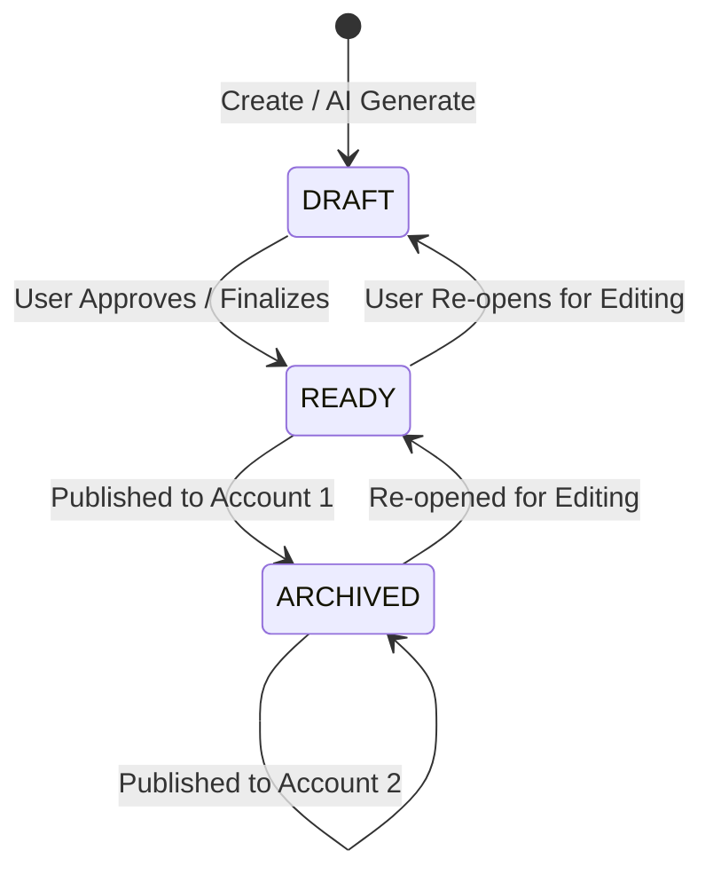
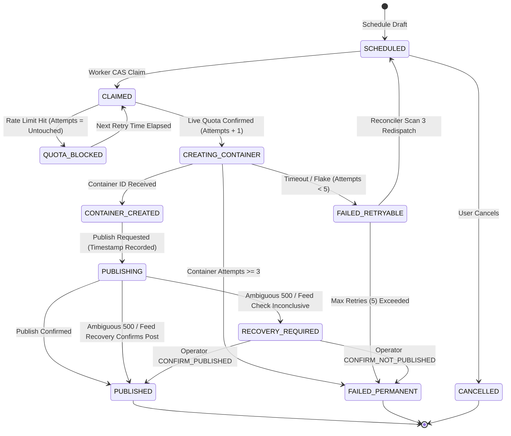
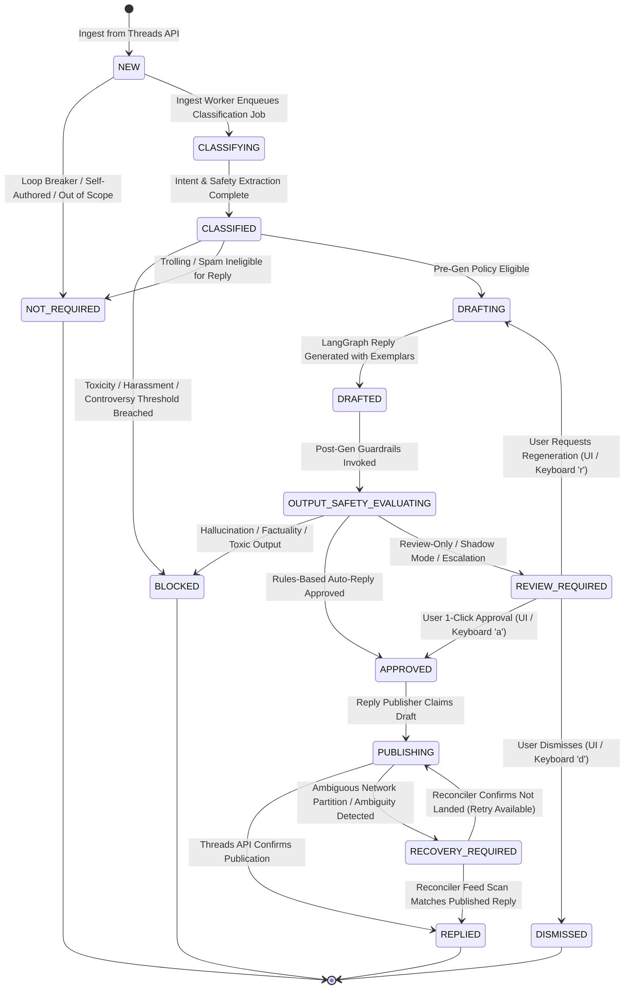
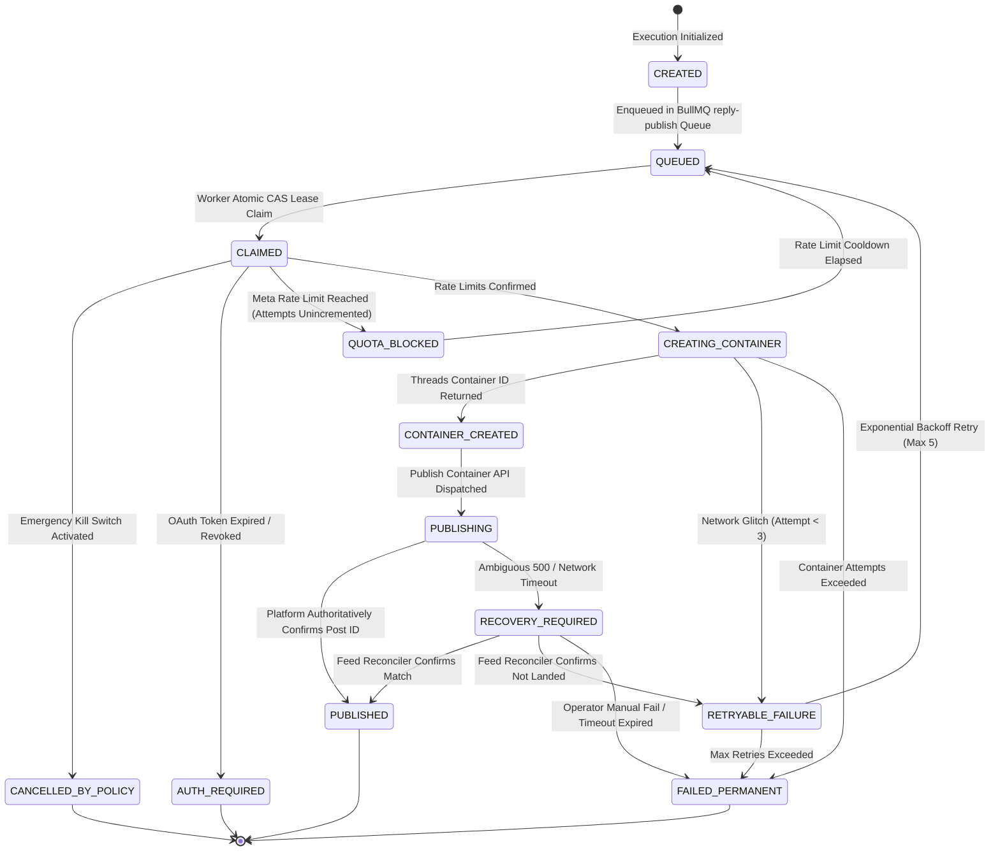
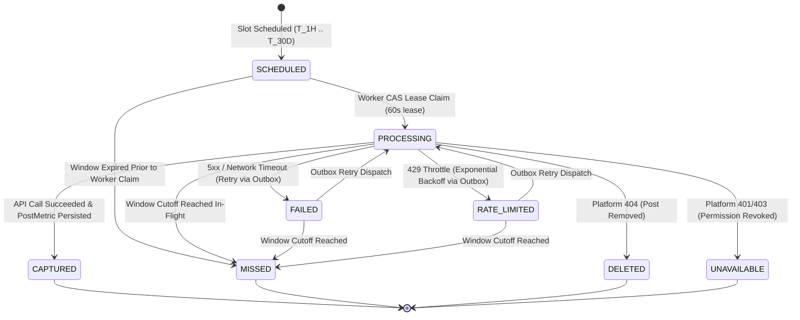
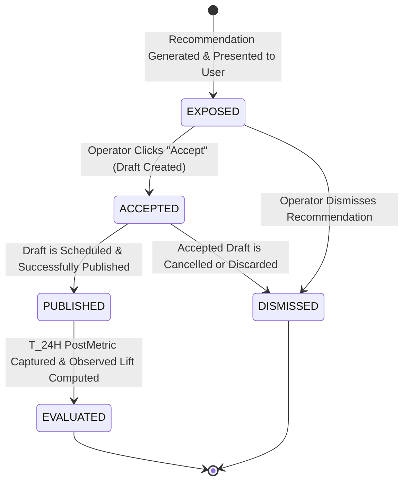

# FRD — ThreadPilot: Functional Requirements Document

**Product Name:** ThreadPilot  
**Document Version:** 1.0  
**Document Type:** Functional Requirements Document (FRD)  
**Status:** Living Engineering Specification & System Architecture Contract  
**Target Platform:** Web Application (Next.js 15) + REST API (NestJS 11) + Async Workers (BullMQ) + Meta Threads Graph API + Google Gemini AI + PostgreSQL with `pgvector`  

---

## 1. Engineering Architecture & System Contracts

### 1.1 Core Architectural Invariant
Every functional requirement in ThreadPilot operates under a strict separation of concerns across infrastructure layers:
- **PostgreSQL 16 (`@threadpilot/database`):** Authoritative source of truth for business entities, state machines, audit trails, and vector memory embeddings (`pgvector`).
- **BullMQ (`apps/worker`):** Durable, asynchronous execution engine running LangGraph agents, ingestion pipelines, and publishing workflows.
- **Redis (`apps/api` & `apps/worker`):** Short-term coordination, atomic distributed locking, rate-limit counters, and real-time Server-Sent Events (SSE) pub/sub streams.
- **Meta Threads Graph API (`@threadpilot/threads-client`):** External platform state. The system never assumes external operations succeed without authoritative confirmation.
- **Google Gemini 2.5 (`@threadpilot/ai`):** Stateless LLM intelligence and vector embeddings (`gemini-embedding-2`, 768 dimensions). The system does not rely on Gemini's server-side session history; PostgreSQL stores all memory.

### 1.2 Monorepo Package Topology
```
[apps/web] ──────(REST / SSE)──────> [apps/api]
                                        │
                         (BullMQ Jobs / Redis PubSub)
                                        ▼
                                  [apps/worker]
                                        │
           ┌────────────────────────────┼────────────────────────────┐
           ▼                            ▼                            ▼
  [@threadpilot/agents]        [@threadpilot/ai]         [@threadpilot/threads-client]
           │                            │                            │
           └────────────────────────────┼────────────────────────────┘
                                        ▼
                           [@threadpilot/database]
                           (PostgreSQL 16 + pgvector)
```

---

## 2. Comprehensive Functional Requirements

Requirements are organized chronologically by system phase and functional domain.

---

### Phase 1: Foundation, Voice Profile & Content Studio *(Implemented)*

#### FR-001: User Registration, Authentication & Password Hashing
- **Phase:** Phase 1 | **Status:** Implemented
- **Touchpoints:**
  - Controller: [`apps/api/src/auth/auth.controller.ts`](file:///d:/Projects/threads-automation/apps/api/src/auth/auth.controller.ts)
  - Service: [`apps/api/src/auth/auth.service.ts`](file:///d:/Projects/threads-automation/apps/api/src/auth/auth.service.ts), [`apps/api/src/auth/password.service.ts`](file:///d:/Projects/threads-automation/apps/api/src/auth/password.service.ts)
  - Models: `User`, `Workspace` in [`schema.prisma`](file:///d:/Projects/threads-automation/packages/database/prisma/schema.prisma)
- **Inputs:** `email` (RFC 5322), `password` (minimum 8 characters, upper/lower/number/symbol).
- **Processing Logic:**
  1. Validates unique email against `users` table.
  2. Hashes password using Argon2id with memory cost $65536$ KB, iterations $3$, parallelism $4$.
  3. Transactionally creates `User` and default personal `Workspace`.
  4. Returns signed JWT access token in response body and issues a rotating refresh token in an `HttpOnly`, `SameSite=Lax`, `Secure` cookie.
- **Outputs:** JWT payload `{ sub: userId, email, workspaceId, exp }` (15m expiration).

#### FR-002: Family-Based Refresh Token Rotation & Reuse Detection
- **Phase:** Phase 1 | **Status:** Implemented
- **Touchpoints:**
  - Service: [`apps/api/src/auth/refresh-token.service.ts`](file:///d:/Projects/threads-automation/apps/api/src/auth/refresh-token.service.ts)
  - Model: `RefreshToken` in [`schema.prisma`](file:///d:/Projects/threads-automation/packages/database/prisma/schema.prisma)
- **Inputs:** Cookie containing base64 refresh token string.
- **Processing Logic:**
  1. Compares presented token against Argon2id hash stored in `refresh_tokens`.
  2. If token is valid and unconsumed (`used_at IS NULL`): Marks `used_at = NOW()`, creates new `RefreshToken` record in same `family_id`, updates cookie.
  3. **Reuse Detection (Compromise Recovery):** If token presented has `used_at IS NOT NULL` (already used): Revokes all tokens sharing that `family_id` (`revoked_at = NOW()`), rejects request with `401 Unauthorized`, forces re-login.

#### FR-003: Multi-Tenant Workspace Tenancy Scoping
- **Phase:** Phase 1 | **Status:** Implemented
- **Touchpoints:**
  - Guards: [`apps/api/src/common/guards/workspace-scope.guard.ts`](file:///d:/Projects/threads-automation/apps/api/src/common/guards/workspace-scope.guard.ts)
  - Decorators: [`apps/api/src/common/decorators/workspace.decorator.ts`](file:///d:/Projects/threads-automation/apps/api/src/common/decorators/workspace.decorator.ts)
- **Processing Logic:**
  1. Every non-auth route requires `x-workspace-id` header or derives workspace from JWT claims.
  2. `WorkspaceScopeGuard` verifies the authenticated user owns or belongs to the target workspace.
  3. All database queries unconditionally include `WHERE workspace_id = :workspaceId`.

#### FR-004: Meta Threads OAuth 2.0 PKCE Authorization
- **Phase:** Phase 1 | **Status:** Implemented
- **Touchpoints:**
  - Service: [`packages/threads-client/src/threads-oauth.service.ts`](file:///d:/Projects/threads-automation/packages/threads-client/src/threads-oauth.service.ts)
  - Controller: [`apps/api/src/threads-auth/threads-auth.controller.ts`](file:///d:/Projects/threads-automation/apps/api/src/threads-auth/threads-auth.controller.ts)
- **Inputs:** Browser redirect to `/threads/authorize`.
- **Processing Logic:**
  1. Generates 43-to-128 char cryptographic `code_verifier` and SHA-256 base64url-encoded `code_challenge`.
  2. Stores `code_verifier` in Redis keyed by state UUID with 10-minute TTL.
  3. Redirects user to Meta OAuth endpoint with requested scopes: `threads_basic`, `threads_content_publish`.
  4. On callback (`/threads/callback`): Exchanges authorization code and `code_verifier` for short-lived token, then exchanges for 60-day long-lived token.

#### FR-005: Versioned AES-256-GCM Token Encryption & Auto-Refresh
- **Phase:** Phase 1 | **Status:** Implemented
- **Touchpoints:**
  - Service: [`packages/threads-client/src/token-encryption.service.ts`](file:///d:/Projects/threads-automation/packages/threads-client/src/token-encryption.service.ts), [`packages/threads-client/src/token.service.ts`](file:///d:/Projects/threads-automation/packages/threads-client/src/token.service.ts)
  - Processor: [`apps/worker/src/processors/token-refresh.processor.ts`](file:///d:/Projects/threads-automation/apps/worker/src/processors/token-refresh.processor.ts)
- **Processing Logic:**
  1. Encrypts tokens using AES-256-GCM with a random 12-byte IV and 16-byte authentication tag.
  2. Stores payload formatted as: `{keyVersion}:{base64(iv + authTag + ciphertext)}`.
  3. Key rotation allows incrementing `TOKEN_ENCRYPTION_KEY_VERSION` without invalidating existing stored tokens.
  4. Worker cron evaluates tokens daily: any token expiring in $< 30$ days is refreshed via Meta's `GET /refresh_access_token`.

#### FR-006: Historical Post Ingestion & Normalization
- **Phase:** Phase 1 | **Status:** Implemented
- **Touchpoints:**
  - Processor: [`apps/worker/src/processors/ingestion.processor.ts`](file:///d:/Projects/threads-automation/apps/worker/src/processors/ingestion.processor.ts)
  - Models: `ExternalPost`, `ThreadPost` in [`schema.prisma`](file:///d:/Projects/threads-automation/packages/database/prisma/schema.prisma)
- **Processing Logic:**
  1. Traverses Meta `GET /me/threads` with cursor pagination.
  2. Stores immutable raw JSON payload in `external_posts`.
  3. Normalizes text and timestamp into canonical `thread_posts` (`sourceType = 'INGESTED'`, `isOurs = true`).
  4. Automatically enqueues `StyleProcessor` and `EmbeddingProcessor` jobs.

#### FR-007: 8-Point Stylometric Feature Extraction
- **Phase:** Phase 1 | **Status:** Implemented
- **Touchpoints:**
  - Graph: [`packages/agents/src/profile/style-extraction.graph.ts`](file:///d:/Projects/threads-automation/packages/agents/src/profile/style-extraction.graph.ts)
  - Processor: [`apps/worker/src/processors/style.processor.ts`](file:///d:/Projects/threads-automation/apps/worker/src/processors/style.processor.ts)
  - Model: `UserProfile` in [`schema.prisma`](file:///d:/Projects/threads-automation/packages/database/prisma/schema.prisma)
- **Extracted Metrics:**
  - `avgPostLengthChars`: Mean character length of posts.
  - `avgSentenceLengthWords`: Average words per sentence.
  - `questionFrequency`: Percentage of posts featuring questions ($0.0 - 1.0$).
  - `emojiFrequency`: Percentage of posts containing emojis.
  - `firstPersonFrequency`: Rate of first-person pronouns ("I", "me", "my").
  - `technicalVocabScore`: Frequency of domain-specific technical vocabulary.
  - `listUsageFrequency`: Percentage of posts formatted as lists.
  - `contraryHookFrequency`: Rate of contrarian or pattern-interrupt openings.
- **Output:** Updates `user_profiles` and creates versioned `style_profile_snapshots`.

#### FR-008: Multi-Representation pgvector Vector Memory
- **Phase:** Phase 1 | **Status:** Implemented
- **Touchpoints:**
  - Repository: [`packages/database/src/memory.repository.ts`](file:///d:/Projects/threads-automation/packages/database/src/memory.repository.ts)
  - Models: `MemoryItem`, `MemoryEmbedding` in [`schema.prisma`](file:///d:/Projects/threads-automation/packages/database/prisma/schema.prisma)
- **Processing Logic:**
  1. Posts are embedded via Google Gemini `gemini-embedding-2` (768 dimensions).
  2. Embeddings are stored in `memory_embeddings` with explicit `task_type`:
     - `DOCUMENT`: Used for semantic exemplar retrieval during drafting.
     - `SIMILARITY`: Used for duplicate detection.
  3. Retrieval executes cosine distance matching via raw PostgreSQL SQL:
     ```sql
     SELECT m.*, (1 - (e.embedding <=> $1::vector)) AS similarity
     FROM memory_items m
     JOIN memory_embeddings e ON e.memory_item_id = m.id
     WHERE m.workspace_id = $2 AND e.task_type = 'DOCUMENT'
     ORDER BY e.embedding <=> $1::vector ASC
     LIMIT $3;
     ```

#### FR-009: Content Idea Generation
- **Phase:** Phase 1 | **Status:** Implemented
- **Touchpoints:**
  - Graph: [`packages/agents/src/content/content.graph.ts`](file:///d:/Projects/threads-automation/packages/agents/src/content/content.graph.ts)
  - Model: `ContentIdea` in [`schema.prisma`](file:///d:/Projects/threads-automation/packages/database/prisma/schema.prisma)
- **Inputs:** Workspace profile, preferred topics, historical high-performing exemplars.
- **Outputs:** Creates `ContentIdea` records containing `title`, `concept`, `reason`, `format`, `topic`, and `confidence` score ($0.0 - 1.0$).

#### FR-010: Multi-Turn LangGraph Content Drafting
- **Phase:** Phase 1 | **Status:** Implemented
- **Touchpoints:**
  - Graph: [`packages/agents/src/content/content.graph.ts`](file:///d:/Projects/threads-automation/packages/agents/src/content/content.graph.ts)
  - Processor: [`apps/worker/src/processors/content.processor.ts`](file:///d:/Projects/threads-automation/apps/worker/src/processors/content.processor.ts)
- **Workflow Steps:**
  1. `load_memory`: Queries vector memory for top 3 exemplars matching the topic.
  2. `generate_initial`: Generates candidate post using few-shot exemplar injection.
  3. `evaluate_draft`: Analyzes hook strength, cadence, and tone consistency.
  4. `refine_draft`: Rewrites draft to maximize punchiness and eliminate filler.
  5. `validate_final`: Strict deterministic validation gate (see FR-011).

#### FR-011: Deterministic 500-Character Final Validation Gate
- **Phase:** Phase 1 | **Status:** Implemented
- **Touchpoints:**
  - Node: `validateFinal` in [`packages/agents/src/content/content.graph.ts`](file:///d:/Projects/threads-automation/packages/agents/src/content/content.graph.ts)
- **Validation Rules:**
  - Length must be $\le 500$ UTF-16 code units (Meta hard limit).
  - Body must not be empty or whitespace-only.
  - Body must not contain markdown code block delimiters (` ``` `) or LLM placeholder tokens (`[Insert Link]`, `TODO`).
  - If validation fails, node automatically truncates or triggers a targeted one-shot compression prompt.

#### FR-012: Version History & Diff Summarization
- **Phase:** Phase 1 | **Status:** Implemented
- **Touchpoints:**
  - Model: `ContentVersion` in [`schema.prisma`](file:///d:/Projects/threads-automation/packages/database/prisma/schema.prisma)
  - Component: [`apps/web/src/components/editor/VersionHistory.tsx`](file:///d:/Projects/threads-automation/apps/web/src/components/editor/VersionHistory.tsx)
- **Processing Logic:**
  - Every AI improvement or manual save increments `version` number on `content_versions`.
  - Computes and stores `diffSummary` comparing version $N$ against version $N-1$.
  - Allows full roll-back to any historical version.

#### FR-013: Server-Sent Events (SSE) Job Progress Streaming
- **Phase:** Phase 1 | **Status:** Implemented
- **Touchpoints:**
  - API Controller: [`apps/api/src/jobs/jobs.controller.ts`](file:///d:/Projects/threads-automation/apps/api/src/jobs/jobs.controller.ts)
  - Service: [`apps/worker/src/services/job-progress.service.ts`](file:///d:/Projects/threads-automation/apps/worker/src/services/job-progress.service.ts)
  - Hook: [`apps/web/src/hooks/useJobProgress.ts`](file:///d:/Projects/threads-automation/apps/web/src/hooks/useJobProgress.ts)
- **Processing Logic:**
  - Workers emit job lifecycle events (`QUEUED` $\rightarrow$ `LOADING_MEMORY` $\rightarrow$ `GENERATING` $\rightarrow$ `EVALUATING` $\rightarrow$ `PERSISTING` $\rightarrow$ `COMPLETE`) via Redis PubSub on channel `job-progress:{requestId}`.
  - API exposes `GET /jobs/:id/events` which subscribes to Redis channel and streams SSE frames to the frontend client.

---

### Phase 2: Resilient Scheduled Publishing Pipeline *(Implemented)*

#### FR-014: Multi-Account Draft Scheduling & Lifecycle Reuse
- **Phase:** Phase 2 | **Status:** Implemented
- **Touchpoints:**
  - Service: [`apps/api/src/content/content.service.ts`](file:///d:/Projects/threads-automation/apps/api/src/content/content.service.ts)
  - Model: `ScheduledPost`, `PublishedPost` in [`schema.prisma`](file:///d:/Projects/threads-automation/packages/database/prisma/schema.prisma)
- **Processing Logic:**
  1. `scheduleDraft()` accepts drafts with `status = 'READY'` or `status = 'ARCHIVED'`.
  2. Verifies draft has not already been published to target account:
     ```typescript
     const exists = await db.publishedPost.findUnique({
       where: { draftId_socialAccountId: { draftId, socialAccountId } }
     });
     if (exists) throw new ConflictException('Already published to this account');
     ```
  3. Ensures no active schedule exists for `(draftId, socialAccountId)` via partial index `idx_scheduled_posts_active_draft`.
  4. Pins `content_version_id`, `content_snapshot`, `content_hash`, and computed `request_fingerprint`.

#### FR-015: Transactional Outbox Pattern for Queue Resilience
- **Phase:** Phase 2 | **Status:** Implemented
- **Touchpoints:**
  - Processor: `EventOutboxProcessor`, `ScheduledPostDispatch`
  - Migration: `0006_scheduled_publishing_fsm/migration.sql`
- **Processing Logic:**
  1. When a post is scheduled, an outbox row `scheduled_post_dispatches` is transactionally inserted with `status = 'PENDING'`.
  2. Redis enqueue occurs asynchronously. If Redis is down, dispatch remains `PENDING`.
  3. Reconciliation Scan 1 periodically sweeps pending dispatches and pushes missing jobs to BullMQ.

#### FR-016: Fenced Worker CAS Execution Claiming
- **Phase:** Phase 2 | **Status:** Implemented
- **Touchpoints:**
  - Processor: `PublishingProcessor`
- **Processing Logic:**
  1. Worker executes atomic compare-and-swap (CAS) via raw SQL:
     ```sql
     WITH claimed AS (
       SELECT id, status AS previous_status
       FROM scheduled_posts
       WHERE id = $1
         AND status IN ('SCHEDULED', 'FAILED_RETRYABLE', 'QUOTA_BLOCKED')
         AND (lease_until IS NULL OR lease_until <= NOW())
       FOR UPDATE SKIP LOCKED
     )
     UPDATE scheduled_posts sp
     SET status = 'CLAIMED',
         claimed_by = $2,
         claimed_at = NOW(),
         lease_until = NOW() + INTERVAL '3 minutes',
         attempt_id = gen_random_uuid()
     FROM claimed c
     WHERE sp.id = c.id
     RETURNING sp.*, c.previous_status;
     ```
  2. If 0 rows are returned, claim failed (another worker acquired or schedule was cancelled). Worker exits without side effects.

#### FR-017: Pre-Execution Quota Gate & Attempt Count Isolation
- **Phase:** Phase 2 | **Status:** Implemented
- **Processing Logic:**
  1. Worker inspects Meta rate limits prior to container creation.
  2. If platform quota is exhausted:
     - Updates `status = 'QUOTA_BLOCKED'`, `next_retry_at = NOW() + 15m`, `last_quota_checked_at = NOW()`.
     - **Attempt count invariant:** Leaves `attempt_count` untouched. Quota checks never consume execution attempts.
  3. Only when live quota is verified does the worker increment `attempt_count = attempt_count + 1`.

#### FR-018: Two-Stage Threads Publishing & Polling FSM
- **Phase:** Phase 2 | **Status:** Implemented
- **Processing Logic:**
  1. Step 4: Calls `POST /me/threads` (`media_type: 'TEXT_POST'`, `text: canonicalBody`). Persists returned `container_id`, transitions to `CONTAINER_CREATED`.
  2. Step 5: Polls `GET /{container_id}?fields=status,error_message` every 2 seconds for up to 30 seconds.
     - `FINISHED`: Proceeds immediately to Step 7 (Publish Commit).
     - `IN_PROGRESS`: Continues polling within budget.
     - `EXPIRED`: Transitions to `FAILED_RETRYABLE` (or `FAILED_PERMANENT` if attempt $\ge 5$).
     - `ERROR`: Fails permanently if non-ambiguous.

#### FR-019: 45-Second Ambiguous Publish Protocol & Feed Recovery
- **Phase:** Phase 2 | **Status:** Implemented
- **Trigger:** Network timeout or HTTP 500/502/504 during `POST /me/threads_publish`.
- **Processing Logic:**
  1. Variable `hasPublishAmbiguity` declared in outer scope; set to `true` immediately before publish call.
  2. Queries user's recent feed (`GET /me/threads?limit=10`).
  3. Evaluates posts created within $\pm 4$ minutes of `publish_requested_at`.
  4. Candidate matching criteria:
     - `p.text === canonicalBody`
     - `p.media_type === 'TEXT_POST'`
     - `sha256(canonicalOutboundText(p.text)) === content_hash`
  5. If exactly 1 matching post is found: Adopts `threads_post_id`, marks `PUBLISHED`.
  6. If 0 or $>1$ candidate found: Transitions to `RECOVERY_REQUIRED` with high-priority admin notification. Never re-publishes blindly.

#### FR-020: Background Watchdog Reconciliation (Scans 1 to 6)
- **Phase:** Phase 2 | **Status:** Implemented
- **Touchpoints:**
  - Service: `PublishingReconciliationService`
- **Reconciliation Scans:**
  - **Scan 1 (Outbox Recovery):** Finds `PENDING` dispatches $> 30$s old; enqueues to BullMQ; marks `DISPATCHED`.
  - **Scan 2 (Due Schedule Watchdog):** Finds `SCHEDULED` posts due within 5m missing from BullMQ; re-dispatches.
  - **Scan 3 (Retry Scanner):** Finds `FAILED_RETRYABLE` posts where `next_retry_at <= NOW()`; redispatches.
  - **Scan 4 (Stale Lease Reclaimer):** Finds `CLAIMED` / `PUBLISHING` posts where `lease_until < NOW()`; reclaims or expires.
  - **Scan 5 (Platform Timestamp Backfill):** Scans `PUBLISHED` posts where `published_at IS NULL`; fetches platform timestamp via `getPost()`; strictly joins on `pp.draft_id = sp.draft_id AND pp.social_account_id = sp.social_account_id`; updates `scheduled_posts`, `published_posts`, and `thread_posts`.
  - **Scan 6 (Outbox Event Reclaim):** Reclaims stale `PROCESSING` events in `event_outbox`.

#### FR-021: Manual Operator Resolution Interface
- **Phase:** Phase 2 | **Status:** Implemented
- **Touchpoints:**
  - Endpoints: `POST /schedules/:id/resolve` (`CONFIRM_PUBLISHED` or `CONFIRM_NOT_PUBLISHED`)
- **Processing Logic:**
  - `CONFIRM_PUBLISHED`: Validates target Threads post exists, is owned by user, and has `media_type === 'TEXT_POST'`. Atomically marks `PUBLISHED`, writes `PublishedPost`, upserts `ThreadPost`, archives draft.
  - `CONFIRM_NOT_PUBLISHED`: Verifies container status is in allowlist (`FINISHED`, `ERROR`, `EXPIRED`). Cancels container, sets schedule to `FAILED_PERMANENT`.

---

### Phase 3: Autonomous Engagement & Community Intelligence *(Implemented)*

#### FR-022: Relational FSM, Check Constraints & Database Invariants (Phase 3A)
- **Phase:** Phase 3 | **Status:** Implemented
- **Touchpoints:**
  - Migration: `0007_engagement_engine` in [`packages/database/prisma/migrations/0007_engagement_engine/migration.sql`](file:///d:/Projects/threads-automation/packages/database/prisma/migrations/0007_engagement_engine/migration.sql)
  - Schema: [`packages/database/prisma/schema.prisma`](file:///d:/Projects/threads-automation/packages/database/prisma/schema.prisma)
  - Spec: [`packages/database/test/engagement-schema-constraints.spec.ts`](file:///d:/Projects/threads-automation/packages/database/test/engagement-schema-constraints.spec.ts)
- **Processing Logic:**
  1. Enforces 15 PostgreSQL enums: `InteractionStatus` (14 states), `ReplyExecutionStatus` (13 states), `AutonomyMode`, `PolicyStage`, `PolicyDecisionType`, `InteractionIntent`, `FeedbackType`, `SyncTier`, `SyncStatus`, `AmbiguityType`, `ResponseDecision`, `Sentiment`, `HideStatus`, `RecoveryResolution`, etc.
  2. Implements 9 core relational models: `EngagementSyncState`, `Interaction`, `InteractionClassification`, `PolicyDecision`, `ReplyDraft`, `ReplyDraftVersion`, `ReplyExecution`, `EditorialFeedback`, `IdempotencyRecord`.
  3. Enforces 8 SQL CHECK constraints:
     - `chk_interaction_priority`: `priority_score BETWEEN 1 AND 10`.
     - `chk_intent_confidence`: `intent_confidence BETWEEN 0.0 AND 1.0`.
     - `chk_toxicity_score`, `chk_harassment_score`, `chk_controversy_score`: Bounded in $[0.0, 1.0]$.
     - `chk_reply_body_non_empty`: Rejects empty or whitespace-only bodies (`LENGTH(TRIM(body)) > 0`).
     - `chk_user_rating`: Restricted to `NULL`, `-1` (thumbs down), or `1` (thumbs up).
     - `chk_sync_error_count`: `error_count >= 0`.
  4. Enforces 4 partial unique indexes:
     - `idx_unique_current_classification`: Guarantees exactly one `is_current = true` record per interaction.
     - `idx_unique_active_reply_execution`: Prevents duplicate in-flight reply executions.
     - `idx_unique_active_sync_lease`: Allows only one active syncing worker per root Threads post.
     - `idx_unique_active_draft_per_interaction`: Prevents multiple active drafts for the same interaction.

#### FR-023: Multi-Tier Adaptive Ingestion & Defense-in-Depth Loop Breaker (Phase 3B)
- **Phase:** Phase 3 | **Status:** Implemented
- **Touchpoints:**
  - Processor: [`apps/worker/src/processors/engagement-ingest.processor.ts`](file:///d:/Projects/threads-automation/apps/worker/src/processors/engagement-ingest.processor.ts)
  - Spec: [`apps/worker/test/engagement-ingest.spec.ts`](file:///d:/Projects/threads-automation/apps/worker/test/engagement-ingest.spec.ts)
- **Processing Logic:**
  1. **Adaptive Sync Tiers:** Polling dynamically scales based on root post creation age:
     - `HOT` (< 24 hours): Synchronizes every 3 minutes.
     - `WARM` (24 hours to 7 days): Synchronizes every 20 minutes.
     - `COLD` (> 7 days): Synchronizes every 3 hours.
  2. **Triple-Check Loop Breaker:** Prevents self-reply bot loops by evaluating three independent layers:
     - Layer 1: Platform `is_reply_owned_by_me === true` flag from Meta API.
     - Layer 2: Case-insensitive username snapshot matching against connected `SocialAccount.username`.
     - Layer 3: Author external ID matching against connected `SocialAccount.externalId`.
     If any check matches, the interaction is flagged with `isReplyOwnedByMe = true` and terminal `status = 'NOT_REQUIRED'`, immediately aborting downstream processing.
  3. **Watermark Management & Resilient Overlap:** Employs sliding timestamp overlaps (5 minutes) and cursor pagination watermarks in `engagement_sync_states` to prevent dropped interactions during network drops.

#### FR-024: Hierarchical Intent Classification & Pre-Policy Gating (Phase 3C)
- **Phase:** Phase 3 | **Status:** Implemented
- **Touchpoints:**
  - Graph: [`packages/agents/src/engagement/interaction-classifier.graph.ts`](file:///d:/Projects/threads-automation/packages/agents/src/engagement/interaction-classifier.graph.ts)
  - Processor: [`apps/worker/src/processors/engagement-classify.processor.ts`](file:///d:/Projects/threads-automation/apps/worker/src/processors/engagement-classify.processor.ts)
  - Rules: [`packages/agents/src/engagement/rules-v1.ts`](file:///d:/Projects/threads-automation/packages/agents/src/engagement/rules-v1.ts)
  - Spec: [`packages/agents/test/engagement-agents.spec.ts`](file:///d:/Projects/threads-automation/packages/agents/test/engagement-agents.spec.ts), [`apps/worker/test/engagement-classify.spec.ts`](file:///d:/Projects/threads-automation/apps/worker/test/engagement-classify.spec.ts)
- **Processing Logic:**
  1. Structured output from Google Gemini classifies intent across 8 categories: `QUESTION`, `AGREEMENT`, `DISAGREEMENT`, `COMPLIMENT`, `REQUEST`, `TROLLING`, `SPAM`, `UNCLEAR`.
  2. Scores sentiment (`POSITIVE`, `NEUTRAL`, `NEGATIVE`) and calculates continuous safety metrics: `toxicityScore`, `harassmentScore`, `controversyScore`, and `isPromptInjection`.
  3. Pre-generation policy rules evaluate classification:
     - `AUTO_REPLY`: High-confidence questions/compliments from non-toxic accounts. Transitions interaction to `DRAFTING`.
     - `REVIEW_REQUIRED`: Disagreements, complex questions, or borderline scores. Transitions to `DRAFTING` with mandatory operator approval.
     - `BLOCKED`: Toxic remarks, harassment, prompt injections, or spam. Immediately transitions to terminal `BLOCKED` with zero LLM draft generation.
  4. Atomically replaces active classification using `is_current = false` updates inside a database transaction.

#### FR-025: Contextual Reply Drafting & 500-Code-Unit Bounds (Phase 3D)
- **Phase:** Phase 3 | **Status:** Implemented
- **Touchpoints:**
  - Graph: [`packages/agents/src/engagement/reply-generation.graph.ts`](file:///d:/Projects/threads-automation/packages/agents/src/engagement/reply-generation.graph.ts)
  - Processor: [`apps/worker/src/processors/reply-draft.processor.ts`](file:///d:/Projects/threads-automation/apps/worker/src/processors/reply-draft.processor.ts)
  - Spec: [`packages/agents/test/engagement-agents.spec.ts`](file:///d:/Projects/threads-automation/packages/agents/test/engagement-agents.spec.ts)
- **Processing Logic:**
  1. Assembles conversation hierarchy: root Threads post content, direct parent comment, author stylometric features, and top-$k$ vector memory exemplars from `MemoryRepository`.
  2. Synthesizes a tone-aligned reply reflecting personal voice guidelines, conversational brevity, and technical positioning.
  3. **Strict 500-Code-Unit Hard Ceiling:** Deterministic UTF-16 code-unit validation (`validateThreadText`). If candidate exceeds 500 code units, the graph performs automatic single-pass compression.
  4. Stores candidate reply as monotonic `ReplyDraftVersion` linked to `ReplyDraft`, storing parent version lineage and diff summary.

#### FR-026: Post-Generation Safety Grounding, Shadow Mode & Kill Switch (Phase 3E)
- **Phase:** Phase 3 | **Status:** Implemented
- **Touchpoints:**
  - Graph: [`packages/agents/src/engagement/post-generation-safety.graph.ts`](file:///d:/Projects/threads-automation/packages/agents/src/engagement/post-generation-safety.graph.ts)
  - Spec: [`apps/worker/test/engagement-autonomy-gate.spec.ts`](file:///d:/Projects/threads-automation/apps/worker/test/engagement-autonomy-gate.spec.ts)
- **Processing Logic:**
  1. Evaluates candidate draft for hallucinated claims, unsupported technical assertions, and brand safety violations.
  2. Gating Decision:
     - If factuality risk $> 0.30$ or brand safety fails: Downgrades decision to `REVIEW_REQUIRED` or `BLOCKED`.
  3. **Autonomy Mode Enforcement:**
     - `REVIEW_ONLY`: Always routes to operator review queue (`status = 'REVIEW_REQUIRED'`).
     - `SHADOW`: Evaluates auto-reply rules and records `wouldAutoReplyInLive = true` for telemetry, but holds the draft in `REVIEW_REQUIRED` with 0 external Meta API calls.
     - `RULES_BASED`: High-confidence, fully grounded replies advance to `APPROVED` and schedule automatic publication.
  4. **Emergency Outbound Kill Switch:** If `repliesPaused === true` in workspace preferences, all auto-reply dispatches are instantly halted and routed to `REVIEW_REQUIRED`.

#### FR-027: Keyset Pagination, Optimistic Concurrency & API Idempotency (Phase 3F)
- **Phase:** Phase 3 | **Status:** Implemented
- **Touchpoints:**
  - Controller: [`apps/api/src/engagement/engagement.controller.ts`](file:///d:/Projects/threads-automation/apps/api/src/engagement/engagement.controller.ts)
  - Service: [`apps/api/src/engagement/engagement.service.ts`](file:///d:/Projects/threads-automation/apps/api/src/engagement/engagement.service.ts)
  - Spec: [`apps/api/test/engagement-controller-gateway.spec.ts`](file:///d:/Projects/threads-automation/apps/api/test/engagement-controller-gateway.spec.ts), [`apps/api/test/engagement-service.spec.ts`](file:///d:/Projects/threads-automation/apps/api/test/engagement-service.spec.ts)
- **Processing Logic:**
  1. Keyset cursor pagination over interactions (`GET /engagement/interactions`) using compound cursor `(priorityScore, createdAt, id)` for stable $O(1)$ pagination.
  2. **Optimistic Concurrency Control:** `PATCH /engagement/interactions/:id/draft` requires HTTP `If-Match` header. If passed version does not match `ReplyDraft.currentVersion.versionNumber`, the request fails with HTTP 409 Conflict.
  3. **Tenant-Scoped Idempotency:** Manual generation requests (`POST /engagement/interactions/:id/draft`) support `Idempotency-Key` header, caching responses in `idempotency_records` table.
  4. **Operator Ambiguity Resolution:** `POST /engagement/executions/:id/resolve` enables operators to confirm or reject ambiguous in-flight publications (`CONFIRM_PUBLISHED` or `CONFIRM_NOT_PUBLISHED`).

#### FR-028: CAS Fenced Reply Publishing, Exponential Backoffs & Watchdog Healing (Phase 3G)
- **Phase:** Phase 3 | **Status:** Implemented
- **Touchpoints:**
  - Processor: [`apps/worker/src/processors/reply-publish.processor.ts`](file:///d:/Projects/threads-automation/apps/worker/src/processors/reply-publish.processor.ts)
  - Watchdog: [`apps/worker/src/services/engagement-reconciliation.service.ts`](file:///d:/Projects/threads-automation/apps/worker/src/services/engagement-reconciliation.service.ts)
  - Outbox: [`apps/worker/src/processors/event-outbox.processor.ts`](file:///d:/Projects/threads-automation/apps/worker/src/processors/event-outbox.processor.ts)
  - Spec: [`apps/worker/test/engagement-fenced-publish.spec.ts`](file:///d:/Projects/threads-automation/apps/worker/test/engagement-fenced-publish.spec.ts), [`apps/worker/test/engagement-reconciliation.spec.ts`](file:///d:/Projects/threads-automation/apps/worker/test/engagement-reconciliation.spec.ts)
- **Processing Logic:**
  1. **Universal CAS Claim Fencing:** Reply execution claiming uses atomic database fencing (`UPDATE reply_executions SET claimed_by = :token, lease_until = NOW() + INTERVAL '2 minutes' WHERE id = :id AND (lease_until IS NULL OR lease_until <= NOW())`).
  2. **Exactly-Once Container Creation:** Once Meta container is created, `containerId` is persisted immediately. Retries never invoke container creation a second time.
  3. **Canonical 429 Exponential Backoffs:** Backoffs follow strictly bounded progression: 5s, 15s, 30s, 60s, then terminal failure. Respects `Retry-After` header when greater.
  4. **Watchdog Reconciler (Scans 0–6):**
     - Scan 0: Heals un-enqueued dispatches from transactional outbox.
     - Scan 1: Reschedules due reply executions.
     - Scan 2: Redispatches retryable failures.
     - Scan 3: Reclaims expired execution leases.
     - Scan 4: Resolves stuck in-flight containers via platform polling.
     - Scan 5: Re-links unlinked executions to parent interactions.
     - Scan 6: Reclaims stale sync state leases in `engagement_sync_states`.
  5. **Transactional Outbox Dispatch:** `REPLY_EXECUTION_DISPATCH` events in `event_outbox` are processed by `EventOutboxProcessor`, reliably queuing jobs into `reply-publish-queue`.

#### FR-029: Editorial Personalization, Word-Level Diffs & Memory Guardrails (Phase 3H)
- **Phase:** Phase 3 | **Status:** Implemented
- **Touchpoints:**
  - Service: [`apps/worker/src/services/editorial-personalization.service.ts`](file:///d:/Projects/threads-automation/apps/worker/src/services/editorial-personalization.service.ts)
  - Spec: [`apps/worker/test/editorial-personalization.spec.ts`](file:///d:/Projects/threads-automation/apps/worker/test/editorial-personalization.spec.ts)
- **Processing Logic:**
  1. Computes word-level diffs (`diffSummary`) between initial AI candidate draft and final human-edited draft.
  2. Records feedback in `editorial_feedbacks` with feedback category (`STYLE_CORRECTION`, `FACTUAL_CORRECTION`, `TONE_CORRECTION`, `LENGTH_CORRECTION`).
  3. **Memory Contamination Guard:** High-rated human edits (`userRating = 1`) are evaluated before vector embedding:
     - Rejects any edit containing PII, API tokens, profanity, or prompt injection artifacts.
     - Embeds clean exemplars into `pgvector` as `DOCUMENT` representation for few-shot dynamic injection into future reply generations.

#### FR-030: Community Review Deck, Telemetry Widgets & Keyboard Shortcuts (Phase 3 UI/UX)
- **Phase:** Phase 3 | **Status:** Implemented
- **Touchpoints:**
  - Views: [`apps/web/src/app/(dashboard)/replies/page.tsx`](file:///d:/Projects/threads-automation/apps/web/src/app/(dashboard)/replies/page.tsx), [`apps/web/src/app/(dashboard)/dashboard/page.tsx`](file:///d:/Projects/threads-automation/apps/web/src/app/(dashboard)/dashboard/page.tsx)
  - Components: [`apps/web/src/components/engagement/`](file:///d:/Projects/threads-automation/apps/web/src/components/engagement/)
  - Spec: [`apps/web/test/engagement-review-deck.spec.ts`](file:///d:/Projects/threads-automation/apps/web/test/engagement-review-deck.spec.ts), [`apps/web/test/engagement-ui-integration.spec.ts`](file:///d:/Projects/threads-automation/apps/web/test/engagement-ui-integration.spec.ts)
- **UI Components & Workflows:**
  1. **Community Review Deck (`/replies`):** Segmented filter tabs (`NEEDS_REVIEW`, `REPLIED`, `AUTO_REPLIED`, `DISMISSED`, `ALL`), search bar, and social account switcher.
  2. **Interaction Card & Detail Deck:** Collapsible thread hierarchy view showing root post, parent comments, author metadata, and draft diff editor.
  3. **Productive Keyboard Shortcuts:**
     - `a` or `Enter`: Approve draft and dispatch publication.
     - `e`: Focus inline draft editor.
     - `r`: Open regeneration prompt modal.
     - `d`: Open dismissal reason modal.
     - `Escape`: Close active modal.
     - Shortcuts are automatically suppressed when user is actively focused in textarea.
  4. **Dashboard Telemetry Widget (`/dashboard`):** Real-time monitoring card displaying active sync status, queue counts, pending review alert badges, and emergency kill switch status.
  5. **Settings Deck (`/settings`):** User selection of Autonomy Mode (`REVIEW_ONLY`, `SHADOW`, `RULES_BASED`) and one-click toggle for Emergency Outbound Kill Switch.

---

### Phase 4: Performance Analytics & Intelligence Loop *(Future Phase)*

#### FR-031: Platform Metrics Synchronization
- **Phase:** Phase 4 | **Status:** Roadmap
- **Processing Logic:**
  1. Worker cron queries Meta Insights API for all published posts created in the last 30 days.
  2. Metrics fetched: `views`, `likes`, `replies`, `reposts`, `quotes`.
  3. Appends historical snapshot to `post_metrics` for longitudinal trend analysis.

#### FR-032: Multi-Dimensional Performance Aggregation
- **Phase:** Phase 4 | **Status:** Roadmap
- **Aggregated Dimensions:**
  - **Topic Level:** Average engagement rate per topic (e.g. AI vs Cloud vs Careers).
  - **Format Level:** Average reach by format (one-liners, tutorials, personal stories).
  - **Hook Style Level:** Performance of contrarian openings vs question openings.
  - **Temporal Level:** Heatmap of reach by day of week and hour of day.

#### FR-033: AI Correlation Insights Generation
- **Phase:** Phase 4 | **Status:** Roadmap
- **Processing Logic:**
  1. AI analyzes performance differentials across stylometric clusters.
  2. Generates structured insights with statistical backing:
     ```json
     {
       "observation": "Contrarian hook patterns generated 34% more replies than standard questions",
       "sample_size": 18,
       "confidence": 0.88,
       "recommendation": "Incorporate contrarian opening hooks for technical debate topics"
     }
     ```
  3. Guardrail: Labels correlations strictly as *observed trends*, never as guaranteed outcomes.

#### FR-034: Performance-Driven Content Recommendations
- **Phase:** Phase 4 | **Status:** Roadmap
- **Processing Logic:**
  - Feeds empirical high-performing topics and formats into `ContentIdea` generator.
  - Dynamically updates topic weights in `user_preferences`.

---

### Phase 5: Autonomous Social Operator & Experiments *(Future Phase)*

#### FR-035: Dynamic Automation Rules Engine
- **Phase:** Phase 5 | **Status:** Roadmap
- **DSL Structure:** Evaluates conditional rules defined by user:
  ```
  IF topic IN ('AI', 'Architecture')
  AND confidence >= 0.92
  AND risk_score == 'LOW'
  AND daily_publish_count < 2
  THEN AUTO_SCHEDULE(next_available_slot)
  ```

#### FR-036: Pre-Publish Safety Gate & Policy Verification
- **Phase:** Phase 5 | **Status:** Roadmap
- **Verification Gates:**
  1. **Hallucination / Personal Claim Check:** Flag any post claiming first-person factual achievements not verified in `user_profile`.
  2. **Controversy / Sentiment Filter:** Screen against sensitive topic blacklists.
  3. **Platform Rate Guard:** Verify rolling 24-hour post count is $< 200$ (well below Meta's 250 limit).

#### FR-037: Native A/B Content Experimentation
- **Phase:** Phase 5 | **Status:** Roadmap
- **Processing Logic:**
  1. User configures an experiment (e.g., Hook A: Direct Statement vs Hook B: Contrarian Question).
  2. System alternates variants across scheduled posts over a 14-day window.
  3. Reports statistical comparison across reach, completion, and reply rate.

#### FR-038: Continuous Profile Adaptation Loop
- **Phase:** Phase 5 | **Status:** Roadmap
- **Processing Logic:**
  - Evaluates quarterly stylometric shift.
  - Proposes refined baseline metrics (e.g. increasing `avgPostLengthChars` from 280 to 340) for user confirmation.

---

## 3. Database Schema Specification

### Current Schema Models (`packages/database/prisma/schema.prisma`)
| Model | Primary Key | Key Fields | Purpose |
|---|---|---|---|
| `User` | UUID | `email`, `passwordHash` | Master user identity |
| `RefreshToken` | UUID | `userId`, `familyId`, `tokenHash`, `usedAt`, `revokedAt` | Family-based refresh token rotation |
| `Workspace` | UUID | `userId`, `name` | Multi-tenant scoping boundary |
| `SocialAccount` | UUID | `workspaceId`, `platform`, `externalId`, `username` | Threads account connection |
| `OAuthToken` | UUID | `socialAccountId`, `accessTokenEncrypted`, `expiresAt` | Versioned AES-256-GCM tokens |
| `UserProfile` | UUID | `workspaceId`, 8 stylometric indicators, `profileVersion` | Stylometric voice definition |
| `StyleProfileSnapshot` | UUID | `workspaceId`, `version`, `features` | Immutable style profile snapshots |
| `UserPreferences` | UUID | `workspaceId`, `preferredTopics`, `autonomyPublishing` | User controls & autonomy settings |
| `MemoryItem` | UUID | `workspaceId`, `type`, `content`, `sourceId` | Authoritative vector memory entity |
| `MemoryEmbedding` | UUID | `memoryItemId`, `model`, `dimensions`, `taskType` | pgvector 768-dim coordinates |
| `ContentIdea` | UUID | `workspaceId`, `title`, `concept`, `topic`, `confidence` | Discovered topical opportunities |
| `ContentDraft` | UUID | `workspaceId`, `ideaId`, `status` (`DRAFT`/`READY`/`ARCHIVED`) | Authoring draft entity |
| `ContentVersion` | UUID | `draftId`, `version`, `body`, `hook`, `diffSummary` | Immutable draft versions |
| `ScheduledPost` | UUID | `draftId`, `socialAccountId`, `status`, `leaseUntil` | Publishing pipeline state machine |
| `PublishedPost` | UUID | `draftId`, `socialAccountId`, `threadsPostId`, `publishedAt` | Authoritative published record |
| `ThreadPost` | UUID | `socialAccountId`, `threadsPostId`, `sourceType`, `isOurs` | Normalized canonical Threads post |
| `JobRecord` | UUID | `workspaceId`, `requestId`, `type`, `status`, `progress` | Background BullMQ job tracking |
| `PlatformRateLimit` | UUID | `socialAccountId`, `category`, `limitValue`, `remaining` | Meta 24-hour rate limit tracker |
| `AgentRun` | UUID | `workspaceId`, `workflowId`, `inputHash`, `totalCostUsd` | LangGraph execution audit trail |
| `AgentAction` | UUID | `runId`, `capability`, `input`, `output`, `result` | Discrete step within agent run |
| `AIUsage` | UUID | `workspaceId`, `provider`, `model`, `inputTokens`, `cost` | LLM token usage accounting |
| `Notification` | UUID | `workspaceId`, `type`, `title`, `body`, `idempotencyKey` | User alerts and notifications |
| `AuditLog` | UUID | `workspaceId`, `action`, `entityType`, `entityId` | Immutable security audit log |
| `ScheduledPostDispatch` | UUID | `scheduledPostId`, `status`, `dispatchedAt` | Outbox dispatch tracking |
| `EventOutbox` | UUID | `workspaceId`, `eventType`, `payload`, `status`, `leaseToken` | Decoupled notification events with lease fencing |
| `EngagementSyncState` | UUID | `socialAccountId`, `rootThreadsPostId`, `syncTier`, `syncStatus`, `leaseToken` | Multi-tier adaptive ingestion sync tracker |
| `Interaction` | UUID | `socialAccountId`, `rootThreadsPostId`, `externalInteractionId`, `content`, `status`, `priorityScore` | Normalized incoming comment/reply FSM |
| `InteractionClassification` | UUID | `interactionId`, `intent`, `intentConfidence`, `sentiment`, `toxicityScore`, `isCurrent` | Structured intent and risk scoring audit record |
| `PolicyDecision` | UUID | `interactionId`, `stage`, `decision`, `reasonCodes`, `isTerminal` | Pre/post policy evaluation record |
| `ReplyDraft` | UUID | `workspaceId`, `interactionId`, `status`, `currentVersionId`, `approvedVersionId` | Active reply draft entity |
| `ReplyDraftVersion` | UUID | `replyDraftId`, `versionNumber`, `body`, `canonicalHash`, `source` | Monotonic immutable reply version history |
| `ReplyExecution` | UUID | `workspaceId`, `interactionId`, `replyDraftVersionId`, `status`, `leaseUntil`, `containerId` | Fenced CAS reply publisher execution tracker |
| `EditorialFeedback` | UUID | `workspaceId`, `interactionId`, `originalText`, `finalText`, `wordDiffSummary`, `isVectorCandidate` | Word diff and exemplar feedback record |
| `IdempotencyRecord` | UUID | `workspaceId`, `key`, `method`, `endpoint`, `response`, `statusCode` | Tenant-scoped API idempotency store |

### Phase 4–5 Roadmap Models
- `PostMetric`: Time-series analytics snapshots (`id`, `threadPostId`, `views`, `likes`, `replies`, `reposts`, `capturedAt`).
- `Insight`: Extracted statistical observations (`id`, `workspaceId`, `observation`, `confidence`, `sampleSize`, `recommendation`).
- `Experiment`: A/B testing campaign (`id`, `workspaceId`, `hypothesis`, `variantA`, `variantB`, `status`, `metrics`).
- `AutomationRule`: User-defined autonomy rule (`id`, `workspaceId`, `conditionsJson`, `actionJson`, `isActive`).

---

## 4. State Machine Specifications

### 4.1 ContentDraft Lifecycle

```mermaid
stateDiagram-v2
    [*] --> DRAFT : Create / AI Generate
    DRAFT --> READY : User Approves / Finalizes
    READY --> DRAFT : User Re-opens for Editing
    READY --> ARCHIVED : Published to Account 1
    ARCHIVED --> READY : Re-opened for Editing
    ARCHIVED --> ARCHIVED : Published to Account 2
```

### 4.2 ScheduledPost Publishing Lifecycle

```mermaid
stateDiagram-v2
    [*] --> SCHEDULED : Schedule Draft
    SCHEDULED --> CLAIMED : Worker CAS Claim
    CLAIMED --> QUOTA_BLOCKED : Rate Limit Hit (Attempts = Untouched)
    QUOTA_BLOCKED --> CLAIMED : Next Retry Time Elapsed
    CLAIMED --> CREATING_CONTAINER : Live Quota Confirmed (Attempts + 1)
    CREATING_CONTAINER --> CONTAINER_CREATED : Container ID Received
    CREATING_CONTAINER --> FAILED_RETRYABLE : Timeout / Flake (Attempts < 5)
    CREATING_CONTAINER --> FAILED_PERMANENT : Container Attempts >= 3
    CONTAINER_CREATED --> PUBLISHING : Publish Requested (Timestamp Recorded)
    PUBLISHING --> PUBLISHED : Publish Confirmed
    PUBLISHING --> RECOVERY_REQUIRED : Ambiguous 500 / Feed Check Inconclusive
    PUBLISHING --> PUBLISHED : Ambiguous 500 / Feed Recovery Confirms Post
    FAILED_RETRYABLE --> SCHEDULED : Reconciler Scan 3 Redispatch
    FAILED_RETRYABLE --> FAILED_PERMANENT : Max Retries (5) Exceeded
    RECOVERY_REQUIRED --> PUBLISHED : Operator CONFIRM_PUBLISHED
    RECOVERY_REQUIRED --> FAILED_PERMANENT : Operator CONFIRM_NOT_PUBLISHED
    SCHEDULED --> CANCELLED : User Cancels
    PUBLISHED --> [*]
    FAILED_PERMANENT --> [*]
    CANCELLED --> [*]
```

### 4.3 Interaction Review Lifecycle (Phase 3)

```mermaid
stateDiagram-v2
    [*] --> NEW : Ingest from Threads API
    NEW --> NOT_REQUIRED : Loop Breaker / Self-Authored / Out of Scope
    NEW --> CLASSIFYING : Ingest Worker Enqueues Classification Job
    CLASSIFYING --> CLASSIFIED : Intent & Safety Extraction Complete
    CLASSIFIED --> BLOCKED : Toxicity / Harassment / Controversy Threshold Breached
    CLASSIFIED --> NOT_REQUIRED : Trolling / Spam Ineligible for Reply
    CLASSIFIED --> DRAFTING : Pre-Gen Policy Eligible
    DRAFTING --> DRAFTED : LangGraph Reply Generated with Exemplars
    DRAFTED --> OUTPUT_SAFETY_EVALUATING : Post-Gen Guardrails Invoked
    OUTPUT_SAFETY_EVALUATING --> BLOCKED : Hallucination / Factuality / Toxic Output
    OUTPUT_SAFETY_EVALUATING --> APPROVED : Rules-Based Auto-Reply Approved
    OUTPUT_SAFETY_EVALUATING --> REVIEW_REQUIRED : Review-Only / Shadow Mode / Escalation
    REVIEW_REQUIRED --> APPROVED : User 1-Click Approval (UI / Keyboard 'a')
    REVIEW_REQUIRED --> DISMISSED : User Dismisses (UI / Keyboard 'd')
    REVIEW_REQUIRED --> DRAFTING : User Requests Regeneration (UI / Keyboard 'r')
    APPROVED --> PUBLISHING : Reply Publisher Claims Draft
    PUBLISHING --> REPLIED : Threads API Confirms Publication
    PUBLISHING --> RECOVERY_REQUIRED : Ambiguous Network Partition / Ambiguity Detected
    RECOVERY_REQUIRED --> REPLIED : Reconciler Feed Scan Matches Published Reply
    RECOVERY_REQUIRED --> PUBLISHING : Reconciler Confirms Not Landed (Retry Available)
    REPLIED --> [*]
    DISMISSED --> [*]
    BLOCKED --> [*]
    NOT_REQUIRED --> [*]
```

### 4.4 ReplyExecution Lifecycle (Phase 3)

```mermaid
stateDiagram-v2
    [*] --> CREATED : Execution Initialized
    CREATED --> QUEUED : Enqueued in BullMQ reply-publish Queue
    QUEUED --> CLAIMED : Worker Atomic CAS Lease Claim
    CLAIMED --> CANCELLED_BY_POLICY : Emergency Kill Switch Activated
    CLAIMED --> AUTH_REQUIRED : OAuth Token Expired / Revoked
    CLAIMED --> QUOTA_BLOCKED : Meta Rate Limit Reached (Attempts Unincremented)
    QUOTA_BLOCKED --> QUEUED : Rate Limit Cooldown Elapsed
    CLAIMED --> CREATING_CONTAINER : Rate Limits Confirmed
    CREATING_CONTAINER --> CONTAINER_CREATED : Threads Container ID Returned
    CREATING_CONTAINER --> RETRYABLE_FAILURE : Network Glitch (Attempt < 3)
    CREATING_CONTAINER --> FAILED_PERMANENT : Container Attempts Exceeded
    CONTAINER_CREATED --> PUBLISHING : Publish Container API Dispatched
    PUBLISHING --> PUBLISHED : Platform Authoritatively Confirms Post ID
    PUBLISHING --> RECOVERY_REQUIRED : Ambiguous 500 / Network Timeout
    RETRYABLE_FAILURE --> QUEUED : Exponential Backoff Retry (Max 5)
    RETRYABLE_FAILURE --> FAILED_PERMANENT : Max Retries Exceeded
    RECOVERY_REQUIRED --> PUBLISHED : Feed Reconciler Confirms Match
    RECOVERY_REQUIRED --> RETRYABLE_FAILURE : Feed Reconciler Confirms Not Landed
    RECOVERY_REQUIRED --> FAILED_PERMANENT : Operator Manual Fail / Timeout Expired
    PUBLISHED --> [*]
    FAILED_PERMANENT --> [*]
    CANCELLED_BY_POLICY --> [*]
    AUTH_REQUIRED --> [*]
```

### 4.5 AnalyticsObservation Lifecycle (Phase 4)

```mermaid
stateDiagram-v2
    [*] --> SCHEDULED : Slot Scheduled (T_1H .. T_30D)
    SCHEDULED --> PROCESSING : Worker CAS Lease Claim (60s lease)
    SCHEDULED --> MISSED : Window Expired Prior to Worker Claim
    PROCESSING --> CAPTURED : API Call Succeeded & PostMetric Persisted
    PROCESSING --> MISSED : Window Cutoff Reached In-Flight
    PROCESSING --> FAILED : 5xx / Network Timeout (Retry via Outbox)
    PROCESSING --> RATE_LIMITED : 429 Throttle (Exponential Backoff via Outbox)
    PROCESSING --> DELETED : Platform 404 (Post Removed)
    PROCESSING --> UNAVAILABLE : Platform 401/403 (Permission Revoked)
    FAILED --> PROCESSING : Outbox Retry Dispatch
    FAILED --> MISSED : Window Cutoff Reached
    RATE_LIMITED --> PROCESSING : Outbox Retry Dispatch
    RATE_LIMITED --> MISSED : Window Cutoff Reached
    CAPTURED --> [*]
    MISSED --> [*]
    DELETED --> [*]
    UNAVAILABLE --> [*]
```

### 4.6 RecommendationExposure Attribution Lifecycle (Phase 4)

```mermaid
stateDiagram-v2
    [*] --> EXPOSED : Recommendation Generated & Presented to User
    EXPOSED --> ACCEPTED : Operator Clicks "Accept" (Draft Created)
    EXPOSED --> DISMISSED : Operator Dismisses Recommendation
    ACCEPTED --> PUBLISHED : Draft is Scheduled & Successfully Published
    ACCEPTED --> DISMISSED : Accepted Draft is Cancelled or Discarded
    PUBLISHED --> EVALUATED : T_24H PostMetric Captured & Observed Lift Computed
    EVALUATED --> [*]
    DISMISSED --> [*]
```

---

## 5. Non-Functional Requirements (NFRs)

| NFR ID | Category | Requirement | Verification Protocol |
|---|---|---|---|
| **NFR-001** | **API Latency** | Standard dashboard endpoints respond in $< 300$ ms ($p95 < 500$ ms). | Automated load testing (`autocannon`) |
| **NFR-002** | **Publishing Idempotency** | Exactly one external publish request executed per attempt. Zero duplicate Threads posts under network partition. | E2E mock network drop test suite |
| **NFR-003** | **Credential Security** | Zero plain-text OAuth tokens stored in database or logs. Client access tokens stored exclusively in browser memory. | Automated static security AST scan |
| **NFR-004** | **Vector Memory Purity** | All embeddings maintain uniform 768 dimensions under `gemini-embedding-2`. Coordinate spaces never mixed. | Database dimension check constraints |
| **NFR-005** | **Observability** | All agent runs trace input hash, output hash, latency, tokens, and USD cost. | Audit verification via `AgentRun` table |
| **NFR-006** | **Platform Compliance** | Strict hard ceiling of 500 characters per post enforced before database commit or API call. | Unit tests in `content.graph.spec.ts` & `engagement-agents.spec.ts` |
| **NFR-007** | **Loop Breaker Invariant** | Ingestion pipeline terminates self-echo loops immediately ($N \le 2$ consecutive bot replies per author thread). | Unit tests in `engagement-ingest.spec.ts` |
| **NFR-008** | **Optimistic Concurrency** | Zero lost edits during concurrent operator review; 409 Conflict returned if target draft version stale. | E2E test in `engagement-controller-gateway.spec.ts` |
| **NFR-009** | **Multiple Testing Control** | Control false discoveries across the entire hypothesis family universe $|U| = m$ using Benjamini-Hochberg FDR at $q \le 0.10$. | Algorithmic tests in `statistical-evidence.spec.ts` |
| **NFR-010** | **Metric Immutability** | Database-engine immutability on `post_metrics`: zero UPDATE permitted; DELETE rejected unless authorized via purge session setting. | PostgreSQL trigger test in `scripts/verify-full-system-e2e.ts` |
| **NFR-011** | **Attribution Ledger Integrity** | Enforce 1:1 attribution linkage with composite `ON DELETE RESTRICT` preventing physical deletion of active evidence. | Foreign key constraint checks in `scripts/verify-full-system-e2e.ts` |
| **NFR-012** | **Deterministic asOf Decay** | Replayed or delayed workers compute bit-for-bit identical decay weights using canonical `asOf` propagation. | Acceptance test suite in `scripts/verify-full-system-e2e.ts` |

---

## 6. Implementation Traceability Matrix

| Requirement | Domain / Phase | Primary Source Files | Primary Spec / Test Files |
|---|---|---|---|
| **FR-001** | Auth / Phase 1 | `apps/api/src/auth/auth.service.ts` | `apps/api/test/auth-service.spec.ts` |
| **FR-002** | Auth / Phase 1 | `apps/api/src/auth/refresh-token.service.ts` | `apps/api/test/auth-service.spec.ts` |
| **FR-003** | Tenancy / Phase 1 | `apps/api/src/common/guards/workspace-scope.guard.ts` | `apps/api/test/cross-tenant-isolation.spec.ts` |
| **FR-004** | OAuth / Phase 1 | `packages/threads-client/src/threads-oauth.service.ts` | `packages/threads-client/test/oauth-negative-paths.spec.ts` |
| **FR-005** | Security / Phase 1 | `packages/threads-client/src/token-encryption.service.ts` | `packages/threads-client/test/token-refresh-concurrency.spec.ts` |
| **FR-006** | Ingestion / Phase 1 | `apps/worker/src/processors/ingestion.processor.ts` | `apps/worker/test/ingestion-interruption.spec.ts` |
| **FR-007** | Voice Profile / Phase 1 | `packages/agents/src/profile/style-extraction.graph.ts` | `apps/worker/test/style-processor.spec.ts` |
| **FR-008** | Memory / Phase 1 | `packages/database/src/memory.repository.ts` | `packages/database/test/real-pgvector-duplicate.spec.ts` |
| **FR-009** | Ideas / Phase 1 | `packages/agents/src/content/content.graph.ts` | `apps/worker/test/content-service.spec.ts` |
| **FR-010** | Drafting / Phase 1 | `packages/agents/src/content/content.graph.ts` | `packages/agents/test/duplicate-calibration.spec.ts` |
| **FR-011** | Validation / Phase 1 | `packages/agents/src/content/content.graph.ts` | `packages/agents/test/duplicate-calibration.spec.ts` |
| **FR-012** | Versioning / Phase 1 | `apps/api/src/content/content.service.ts` | `apps/api/test/content-service.spec.ts` |
| **FR-013** | Streaming / Phase 1 | `apps/worker/src/services/job-progress.service.ts` | `apps/web/src/hooks/useJobProgress.ts` |
| **FR-014** | Scheduling / Phase 2 | `apps/api/src/content/content.service.ts` | `apps/api/test/content-service.spec.ts` |
| **FR-015** | Calendar UI / Phase 2 | `apps/web/src/app/(dashboard)/schedule/page.tsx` | `apps/web/test/calendar-schedules.spec.ts` |
| **FR-016** | Fenced Claim / Phase 2 | `apps/worker/src/processors/publishing.processor.ts` | `apps/worker/test/publishing-processor.spec.ts` |
| **FR-017** | Quota Gate / Phase 2 | `apps/worker/src/processors/publishing.processor.ts` | `apps/worker/test/publishing-processor.spec.ts` |
| **FR-018** | Publishing / Phase 2 | `packages/threads-client/src/threads-api.client.ts` | `packages/threads-client/test/threads-api.client.spec.ts` |
| **FR-019** | Ambiguity / Phase 2 | `apps/worker/src/processors/publishing.processor.ts` | `apps/worker/test/publishing-processor.spec.ts` |
| **FR-020** | Reconciler / Phase 2 | `apps/worker/src/processors/publishing-reconciliation.service.ts` | `apps/worker/test/publishing-reconciliation.spec.ts` |
| **FR-021** | Event Outbox / Phase 2 | `apps/worker/src/processors/event-outbox.processor.ts` | `apps/worker/test/event-outbox-processor.spec.ts` |
| **FR-022** | Adaptive Ingestion / Phase 3 | `apps/worker/src/processors/engagement-ingest.processor.ts` | `apps/worker/test/engagement-ingest.spec.ts` |
| **FR-023** | Loop Breaker / Phase 3 | `apps/worker/src/processors/engagement-ingest.processor.ts` | `apps/worker/test/engagement-ingest.spec.ts` |
| **FR-024** | Classifier Graph / Phase 3 | `packages/agents/src/engagement/interaction-classifier.graph.ts` | `apps/worker/test/engagement-classify.spec.ts` |
| **FR-025** | Reply Gen Graph / Phase 3 | `packages/agents/src/engagement/reply-generation.graph.ts` | `packages/agents/test/engagement-agents.spec.ts` |
| **FR-026** | Safety Gate / Phase 3 | `packages/agents/src/engagement/post-generation-safety.graph.ts` | `packages/agents/test/engagement-agents.spec.ts` |
| **FR-027** | Policy Engine / Phase 3 | `packages/agents/src/engagement/post-generation-safety.graph.ts` | `apps/worker/test/engagement-autonomy-gate.spec.ts` |
| **FR-028** | Fenced Reply Pub / Phase 3 | `apps/worker/src/processors/reply-publish.processor.ts` | `apps/worker/test/engagement-fenced-publish.spec.ts` |
| **FR-029** | Editorial Loop / Phase 3 | `apps/api/src/engagement/editorial-personalization.service.ts` | `apps/worker/test/editorial-personalization.spec.ts` |
| **FR-030** | Review Deck & UI / Phase 3 | `apps/web/src/app/(dashboard)/replies/page.tsx` | `apps/web/test/engagement-review-deck.spec.ts` |
| **FR-031** | Fenced Observation & Ingestion / Phase 4 | `apps/worker/src/processors/analytics-sync.processor.ts` | `apps/worker/test/observation-fsm.spec.ts` |
| **FR-032** | Multi-Dim Cohort Aggregation / Phase 4 | `apps/worker/src/processors/analytics-aggregate.processor.ts` | `apps/worker/test/dimension-resolvers.spec.ts` |
| **FR-033** | Welch & BH-FDR Evidence / Phase 4 | `apps/worker/src/services/statistical-evidence.service.ts` | `apps/worker/test/statistical-evidence.spec.ts` |
| **FR-034** | Evidence-Gated AI Insights / Phase 4 | `apps/worker/src/processors/analytics-insights.processor.ts` | `apps/api/test/analytics-pipeline.spec.ts` |
| **FR-035** | Longitudinal Profile Learning / Phase 4 | `apps/worker/src/services/learning-profile.service.ts` | `apps/api/test/analytics-pipeline.spec.ts` |
| **FR-036** | 1:1 Attribution Ledger & Recs / Phase 4 | `apps/worker/src/services/recommendation-engine.service.ts` | `scripts/verify-full-system-e2e.ts` |
| **FR-037** | Transactional Analytics Outbox / Phase 4 | `apps/worker/src/services/analytics-outbox-dispatch.service.ts` | `apps/api/test/analytics-pipeline.spec.ts` |
| **FR-038** | Analytics Dashboard & Deck UI / Phase 4 | `apps/web/src/app/(dashboard)/analytics/page.tsx` | `apps/web/test/analytics-ui-integration.spec.ts` |
| **FR-039** | Rules Engine / Phase 5 | `apps/worker/src/services/rules-engine.service.ts` *(Roadmap)* | `apps/worker/test/rules-engine.spec.ts` |
| **FR-040** | Pre-Publish Safety / Phase 5 | `packages/agents/src/safety/pre-publish.guard.ts` *(Roadmap)* | `packages/agents/test/safety-guard.spec.ts` |
| **FR-041** | Native A/B Testing / Phase 5 | `apps/api/src/experiments/experiment.service.ts` *(Roadmap)* | `apps/api/test/experiments.spec.ts` |
| **FR-042** | Profile Adaptation / Phase 5 | `packages/agents/src/profile/adaptation.graph.ts` *(Roadmap)* | `packages/agents/test/adaptation.spec.ts` |
