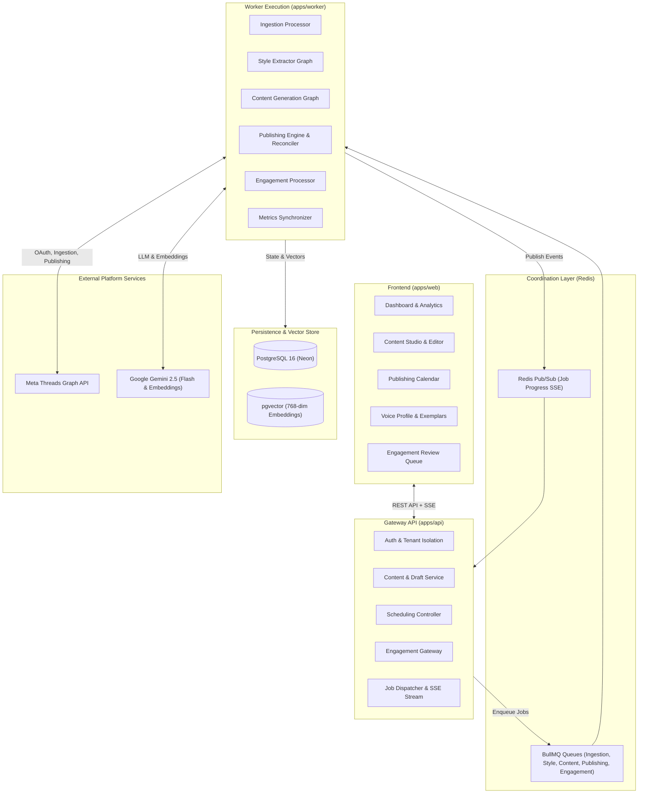
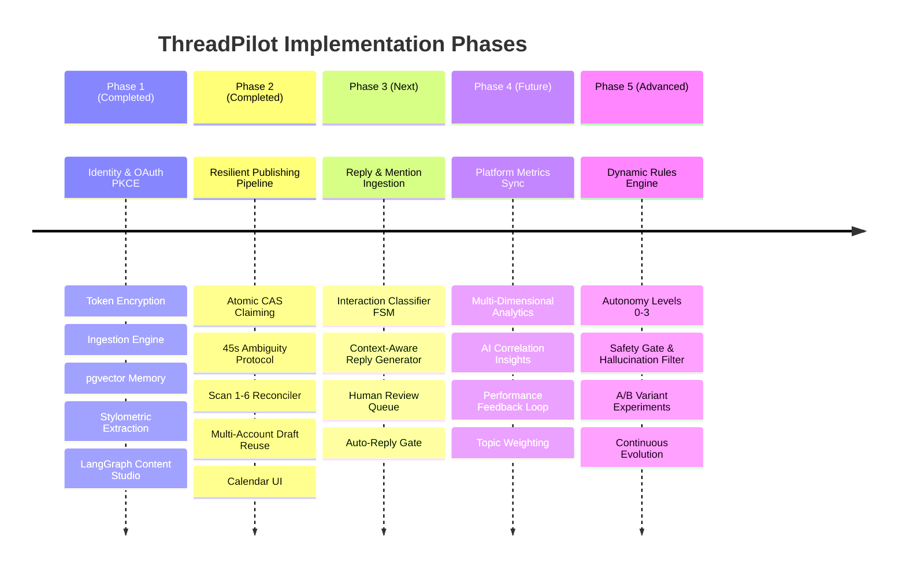

# PRD — ThreadPilot: Personal Social AI Platform for Threads

**Product Name:** ThreadPilot  
**Document Version:** 1.0  
**Document Type:** Product Requirements Document (PRD)  
**Status:** Living Engineering Document & Evolution Roadmap  
**Target Platform:** Web Application (Next.js 15) + API (NestJS 11) + Async Workers (BullMQ) + Meta Threads Graph API + Google Gemini AI + PostgreSQL with `pgvector`  
**Primary Goal:** Enable creators, developers, and founders to automate their Threads presence while continuously learning, preserving, and reproducing their personal writing voice, topical authority, and interaction patterns.

---

## 1. Executive Summary & Product Vision

### 1.1 The Vision
**ThreadPilot** is an AI-powered personal social operating system designed specifically for Meta's Threads network. Unlike generic social-media schedulers that treat content creation as generic text generation, ThreadPilot models the author. It implements a closed-loop operating lifecycle:

$$\text{Understand Author} \longrightarrow \text{Discover Opportunities} \longrightarrow \text{Generate Content} \longrightarrow \text{Improve \& Validate} \longrightarrow \text{Publish} \longrightarrow \text{Engage} \longrightarrow \text{Analyze} \longrightarrow \text{Learn} \longrightarrow \text{Adapt Profile}$$

ThreadPilot acts as a high-fidelity **AI Social Media Operator** trained on the user's authentic history. Routine tasks (formatting, initial drafting, trend synthesis, schedule execution, comment categorization) become increasingly autonomous, while sensitive decisions (final post approval, controversial replies, brand positioning) remain under strict human control.

### 1.2 Core Architectural Invariant
```
PostgreSQL owns business state.
BullMQ owns execution.
Redis owns coordination.
Threads owns platform state.
pgvector owns semantic memory.
Google Gemini owns generation & extraction.
```

---

## 2. Problem Statement & Value Proposition

### 2.1 The Problem
Building an impactful presence on Threads requires high consistency across multiple cognitively demanding tasks:
1. **Topical Opportunity Sourcing:** Scanning tech trends, news, and community discussions.
2. **Personal Voice Consistency:** Maintaining a distinct voice (sentence cadence, vocabulary density, tone, hooks) across dozens of posts per week.
3. **Format Optimization:** Complying with platform realities (500-character limit, strong single-line hooks, conversation starters).
4. **Publishing Cadence:** Timing posts across global audience timezones without manual intervention.
5. **Engagement Maintenance:** Monitoring incoming replies, filtering spam/trolling, and crafting thoughtful, tone-consistent replies.
6. **Absence of a Learning Loop:** Current tools lack memory; every post generation starts from zero without awareness of what writing styles resonated historically.

### 2.2 The Solution: The Personal Social Profile
ThreadPilot solves this by maintaining a continuously evolving **Personal Social Profile** backed by:
- **8-Point Stylometric Fingerprinting** extracted from authentic historical posts.
- **Multi-Representation Semantic Vector Memory** (`pgvector`) retrieving past exemplar posts as few-shot guidance.
- **Fail-Safe Asynchronous Publishing Pipeline** with atomic database fencing and platform reconciliation.
- **Human-in-the-Loop Engagement Agent** with automated interaction classification.

---

## 3. Target Personas & Use Cases

### 3.1 Primary Personas
- **Technical Founders & Solo Entrepreneurs:** Need regular industry visibility to build audience and distribution, but have zero bandwidth for daily manual authoring.
- **Software Engineers & Creators:** Possess deep domain expertise and distinct writing styles, but struggle with consistent hook writing, formatting, and regular scheduling.
- **Domain Experts & Researchers:** Want to translate complex ideas into bite-sized, engaging Threads posts without compromising nuance.

### 3.2 Key Use Cases
| Use Case | Description | Primary Value |
|---|---|---|
| **Zero-Cold-Start Drafting** | Generate 5 authentic post drafts from a technical URL or topic in seconds. | Eliminates blank-canvas writer's block. |
| **Voice Preservation** | Rewrites or polishes rough ideas while strictly enforcing the author's stylometrics. | Guarantees authentic personal voice. |
| **Fail-Safe Scheduling** | Schedule posts across multiple Threads accounts with automatic queue-loss recovery. | Prevents silent publishing drops or duplicate posts. |
| **Conversational Review Queue** | Auto-classifies incoming replies and drafts context-aware responses for 1-click approval. | Cuts daily engagement time by 80%. |
| **Empirical Style Learning** | Identifies writing patterns (e.g. contrarian hooks vs questions) correlating with higher reach. | Eliminates guesswork in content strategy. |

---

## 4. Product Goals & Non-Goals

### 4.1 Primary Goals
1. **Authentic Content Generation:** Generate Threads drafts that faithfully reflect the user's stylometric profile.
2. **Continuous Learning Loop:** Extract writing patterns from historical posts and refine them using user edits and platform performance.
3. **Resilient Publishing:** Deliver zero-duplicate, at-most-once publishing guarantees over Meta's Threads API with automatic network recovery.
4. **Context-Aware Engagement:** Classify replies and generate tone-matched response candidates.
5. **Progressive Autonomy:** Enable users to graduate from 100% manual review to rules-based autonomous publishing.
6. **Multi-Tenant Isolation:** Ensure strict workspace tenancy, in-memory client token security, and AES-256-GCM OAuth credential encryption.

### 4.2 Non-Goals (Strict Guardrails for Version 1)
- **No Cross-Platform Expansion:** ThreadPilot is strictly focused on Meta Threads. No X (Twitter), LinkedIn, or Instagram cross-posting in Version 1.
- **No Persona Impersonation:** ThreadPilot will not generate content designed to mimic third parties or fabricate personal lived experiences.
- **No Engagement Farming:** The system will never generate generic spam ("Great post!", "Thoughts?"), engagement bait, or automated mass-follow actions.
- **No Unfenced Autonomous Replies:** Auto-replies will never engage with political controversy, personal attacks, or ambiguous context without human approval.
- **No Private Account Scraping:** All data ingestion relies exclusively on authoritative Meta Threads Graph API endpoints.

---

## 5. System Architecture & High-Level Information Flow



---

## 6. Implementation Phases: The Living Roadmap

ThreadPilot is architected in 5 distinct, loosely coupled phases. Each phase builds upon the data contracts of the preceding phase while maintaining independent modularity.



### Phase 1: Foundation & Personal Voice Intelligence *(Fully Implemented)*
- Multi-tenant workspace architecture with family-based refresh token rotation and in-memory access token security.
- Meta Threads OAuth 2.0 PKCE with AES-256-GCM token encryption and key versioning.
- Authoritative historical post ingestion storing raw payloads and normalized `ThreadPost` records.
- Multi-representation vector storage in `pgvector` with Google Gemini 768-dimensional embeddings.
- 8-point stylometric feature extraction (`StyleExtractionGraph`) computing vocabulary depth, sentence length, emoji frequency, and hook patterns.
- Multi-turn LangGraph drafting engine (`ContentGenerationGraph`) with exemplar retrieval and strict 500-character final validation gate.
- Next.js 15 dashboard with real-time SSE job progress tracking, draft editor, and voice profile card.

### Phase 2: Resilient Scheduled Publishing Pipeline *(Fully Implemented)*
- Fail-safe state machine for scheduled posts: `SCHEDULED` $\rightarrow$ `CLAIMED` $\rightarrow$ `CREATING_CONTAINER` $\rightarrow$ `CONTAINER_CREATED` $\rightarrow$ `PUBLISHING` $\rightarrow$ `PUBLISHED`.
- Atomic PostgreSQL CAS claim fencing (`UPDATE ... WHERE id = :id AND lease_until <= NOW() RETURNING *`).
- Pre-execution quota gating preserving attempt counts without exhausting retry budgets.
- Two-stage container publishing with 45-second ambiguous publish recovery protocol (feed matching within $\pm4$ min window).
- Background reconciliation watchdog with 6 asynchronous healing scans (un-enqueued dispatches, due schedules, retry backoffs, stale leases, timestamp backfills, outbox events).
- Scoped multi-account publishing allowing `ARCHIVED` drafts to be scheduled across accounts without unique collision.
- Front-end calendar scheduling, timezone handling, and operator resolution interface for quarantined posts.

### Phase 3: Engagement Engine & Conversational Intelligence *(Next Phase)*
- Periodic retrieval and webhook subscription for incoming replies, quotes, and mentions via Meta Threads Graph API.
- Interaction classification state machine (`QUESTION`, `AGREEMENT`, `DISAGREEMENT`, `COMPLIMENT`, `REQUEST`, `TROLLING`, `SPAM`, `UNCLEAR`).
- Context-aware reply generation adhering to the user's disagreement style, conversational humor, and technical depth.
- Interactive human review queue (Approve, Edit, Regenerate, Dismiss) in `apps/web`.
- Editorial feedback loop: user edits to generated replies are stored as fine-tuning learning exemplars.
- Conditional auto-reply rules for high-confidence, non-controversial question categories.

### Phase 4: Performance Analytics & Intelligence Loop *(Future Phase)*
- Periodic synchronization of platform performance metrics (impressions, views, likes, replies, reposts, quotes).
- Multi-dimensional analytics aggregation:
  - **Post Level:** Reach, virality rate, reply engagement.
  - **Topic Level:** Performance by subject area (e.g. AI Agents vs Web Architecture).
  - **Format Level:** Comparative performance of one-liners, tutorials, personal anecdotes, and threads.
  - **Temporal Level:** Best posting hours and days per social account.
- AI-driven correlation engine: extracts verifiable hypotheses (e.g., "Contrarian hooks generate 38% more replies on technical topics with $p < 0.05$").
- Dynamic content recommendations: suggests upcoming topics and structural improvements based on empirical data.

### Phase 5: Autonomous Social Operator & Content Experimentation *(Future Phase)*
- User-configurable Automation Rules Engine (`IF topic = 'AI' AND confidence > 0.90 AND risk = 'LOW' THEN auto-schedule`).
- Autonomy Level Matrix:
  - **Level 0 (Manual):** AI generates suggestions only; user manually drafts and triggers publishing.
  - **Level 1 (Approval):** AI drafts and schedules; user explicitly clicks "Approve".
  - **Level 2 (Rules-Based):** AI auto-publishes content that matches strict rule criteria.
  - **Level 3 (Autonomous Operator):** AI selects topic, format, timing, and creates content within weekly bounds.
- Safety Gate & Policy Enforcement: Pre-publish hallucination check, personal-claim verification, sentiment fence, and platform rate limit protection.
- Native A/B Content Experimentation: Multi-variant testing on hooks, post length, and CTAs with statistical significance reporting.
- Continuous Profile Adaptation: Automatic micro-adjustments to style parameters based on monthly audience response.

---

## 7. Product Modules Specification

### Module 1: Account, Multi-Tenancy & Security
- **Workspace Architecture:** Workspaces act as the administrative boundary. All social accounts, drafts, style profiles, and vector memories are strictly scoped by `workspace_id`.
- **In-Memory Token Security:** API access tokens are held exclusively in browser memory. Refresh tokens are stored in HttpOnly, SameSite=Lax cookies with cryptographic Argon2id hashing and family-based reuse detection.
- **Threads OAuth PKCE:** Implements standard OAuth 2.0 PKCE exchange (`code_verifier` and `code_challenge`) via [`ThreadsOAuthService`](file:///d:/Projects/threads-automation/packages/threads-client/src/threads-oauth.service.ts).
- **Encrypted Token Store:** Access tokens and refresh tokens are encrypted at rest using AES-256-GCM with key versioning (`{keyVersion}:{iv}:{authTag}:{ciphertext}`) via [`TokenEncryptionService`](file:///d:/Projects/threads-automation/packages/threads-client/src/token-encryption.service.ts).

### Module 2: Personal AI Voice Profile & Stylometrics
- **8 Core Stylometric Indicators:**
  1. `avgPostLengthChars`: Typical character count per post.
  2. `avgSentenceLengthWords`: Average sentence length and complexity.
  3. `questionFrequency`: Proportion of posts ending in or featuring questions.
  4. `emojiFrequency`: Usage rate and preferred emoji sets.
  5. `firstPersonFrequency`: Use of "I", "my", "we" vs objective/third-person prose.
  6. `technicalVocabScore`: Frequency of domain-specific technical terminology.
  7. `listUsageFrequency`: Tendency to use bulleted or numbered structures.
  8. `contraryHookFrequency`: Tendency to open with contrarian or pattern-interrupt statements.
- **Immutable Snapshots:** Every time the profile is calibrated or edited, a versioned snapshot is stored in `style_profile_snapshots` for complete auditability.
- **Identity Overrides:** High-level positioning, bio, profession, and areas of expertise are protected from AI mutation and can only be modified by the user.

### Module 3: Vector Memory & Exemplar Retrieval
- **pgvector Multi-Representation Architecture:** High-performing historical posts are embedded into PostgreSQL `pgvector` using Google Gemini `gemini-embedding-2` (768 dimensions).
- **Task-Specific Coordinates:** Embeddings are partitioned by task type (`DOCUMENT` for retrieval, `SIMILARITY` for duplicate detection) to maintain vector coordinate purity.
- **Dynamic Few-Shot Injection:** When generating content, the system performs cosine-similarity matching against the user's past exemplars, injecting authentic examples directly into the LLM system prompt.

### Module 4: Topic & Trend Discovery
- **Relevance Scoring Algorithm:** Evaluates potential post topics using a composite formula:
  $$\text{Opportunity Score} = 0.35 \times \text{User Interest} + 0.30 \times \text{Historical Performance} + 0.20 \times \text{Trend Momentum} + 0.15 \times \text{Topic Gap}$$
- **Transparency:** The system provides natural language explanations for every suggested topic (e.g., *"Suggested because your posts on LangGraph received 40% higher replies than average"*).

### Module 5: Content Generation Studio
- **Multi-Turn LangGraph Architecture:** Powered by [`ContentGenerationGraph`](file:///d:/Projects/threads-automation/packages/agents/src/content/content.graph.ts):
  1. `load_memory`: Fetches profile metrics and top-k vector exemplars.
  2. `generate_initial`: Generates structured drafts matching the user's hooks and cadence.
  3. `evaluate_draft`: Analyzes hook strength, readability, and stylistic adherence.
  4. `refine_draft`: Applies targeted rewrites to improve punchiness.
  5. `validate_final`: Hard deterministic check ensuring length $\le 500$ chars, no placeholder text, and non-empty body.
- **Version Tracking:** Every generation or user edit creates an immutable `ContentVersion` record with diff summaries.

### Module 6: AI Editorial Improvement Panel
- **Targeted Transformation Presets:**
  - *Sharpen Hook:* Rewrites opening lines using contrarian or curiosity-gap techniques.
  - *Make Concise:* Strips filler phrases and optimizes reading cadence.
  - *Add Personal Voice:* Injects first-person perspective and personal positioning.
  - *Technical Deep-Dive:* Increases vocabulary depth and nuance.
- **Visual Diff Comparison:** Highlights line-by-line additions and deletions before user acceptance.

### Module 7: Content Calendar & Scheduling Management
- **Visual Calendar Interface:** Day, week, and month views displaying queued, publishing, and published posts.
- **Timezone Awareness:** Explicit validation of IANA timezone identifiers with UTC instant persistence.
- **Multi-Account Scoped Scheduling:** Supports scheduling the same `ARCHIVED` draft to multiple Threads accounts at different times without database constraint collision.

### Module 8: Resilient Publishing Engine
- **Atomic Fenced Execution:** Worker leases posts using unique execution attempt UUIDs, preventing dual-worker execution.
- **Two-Stage Threads Publishing:** First creates a container via `POST /me/threads`, polls container status (`FINISHED`, `ERROR`, `EXPIRED`), then commits via `POST /me/threads_publish`.
- **45-Second Ambiguous Publish Protocol:** If a network timeout occurs during publish commit, the worker evaluates recent feed history ($\pm4$ min) to verify actual platform publication before declaring failure.
- **Watchdog Reconciliation:** Background reconciler (Scans 1 to 6) recovers lost Redis jobs, expired leases, and missing platform timestamps without manual operator intervention.

### Module 9: Engagement Monitoring & Interaction Tracking
- **Interaction Polling & Webhook Handler:** Ingests replies, mentions, and quotes associated with the user's published Threads posts.
- **Interaction FSM:** State transitions from `NEW` $\rightarrow$ `CLASSIFIED` $\rightarrow$ `DRAFTED` $\rightarrow$ `APPROVED` $\rightarrow$ `REPLIED` (or `DISMISSED`).
- **Priority Queue:** Sorts interactions by engagement potential (e.g. questions from verified accounts prioritized over simple emojis).

### Module 10: Context-Aware Reply Generation
- **Context Synthesis:** Ingests the parent post, the full conversation thread, the user's style profile, and specific disagreement rules.
- **Review Queue Interface:** Provides a Tinder-style or inbox-style workflow: Approve, Edit, Regenerate, Dismiss.
- **Active Learning:** Every manual edit by the user is logged as training signal for future reply generation.

### Module 11: Analytics & Performance Engine
- **Automated Metric Ingestion:** Ingests views, likes, replies, reposts, and quotes via Meta Threads Graph API.
- **Time-Series Metric Snapshots:** Stores periodic snapshots allowing historical reach curves and virality tracking.
- **Normalized Scoring:** Computes engagement rates adjusted for account follower count and posting time.

### Module 12: Learning Engine & Style Adaptation
- **Pattern Extraction:** Correlates stylometric features (e.g., question frequency, sentence length) with performance metrics.
- **Correlation Guardrails:** Clearly demarcates statistical correlation vs causation to prevent degenerate AI feedback loops.
- **Profile Evolution:** Proposes quarterly or monthly profile micro-adjustments subject to user approval.

### Module 13: Content Insights & Strategy Recommendations
- **Weekly Executive Briefing:** Summarizes top-performing topics, winning hook formats, and engagement bottlenecks.
- **Gap Analysis:** Identifies core expertise areas that have been neglected in the recent posting calendar.

### Module 14: Experimentation & A/B Testing Framework
- **Variant Testing:** Enables users to test two hook styles (e.g., direct statement vs contrarian observation) across similar scheduled posts.
- **Statistical Significance Engine:** Evaluates performance deltas across 14-day observation windows.

---

## 8. Monorepo Project Structure & Codebase Reference

Every module and phase maps directly to existing or planned files across the ThreadPilot Turborepo codebase:

```
threadpilot/
├── apps/
│   ├── api/                                      # NestJS 11 Gateway Service
│   │   └── src/
│   │       ├── auth/                             # User authentication, Argon2id, JWT rotation
│   │       │   ├── auth.controller.ts            # POST /auth/login, /auth/register, /auth/refresh
│   │       │   ├── auth.service.ts               # User creation, credential validation
│   │       │   ├── password.service.ts           # Argon2id password hashing
│   │       │   ├── refresh-token.service.ts      # Family-based refresh token rotation
│   │       │   └── token.service.ts              # In-memory access token signing
│   │       ├── common/                           # Cross-cutting decorators, guards, filters
│   │       │   ├── decorators/                   # @CurrentUser(), @CurrentWorkspace()
│   │       │   ├── filters/                      # GlobalExceptionFilter (RFC 7807 problem details)
│   │       │   ├── guards/                       # JwtAuthGuard, WorkspaceScopeGuard
│   │       │   └── redis/                        # Redis client provider
│   │       ├── content/                          # Drafts, Ideas, Versions & Scheduling API
│   │       │   ├── content.controller.ts         # Endpoints for ideas, drafts, versions, scheduling
│   │       │   └── content.service.ts            # Business logic for drafts, scheduling, CAS checks
│   │       ├── ingestion/                        # Historical post ingestion triggers
│   │       │   ├── ingestion.controller.ts       # POST /ingestion/trigger
│   │       │   └── ingestion.service.ts          # Dispatches BullMQ ingestion jobs
│   │       ├── jobs/                             # Background job tracking & SSE stream
│   │       │   ├── job-dispatcher.service.ts     # Enqueues BullMQ tasks with idempotency
│   │       │   ├── jobs.controller.ts            # GET /jobs/:requestId/status & /jobs/:id/events (SSE)
│   │       │   └── jobs.service.ts               # Queries job records from database
│   │       ├── notifications/                    # In-app notifications
│   │       │   ├── notifications.controller.ts   # GET /notifications
│   │       │   └── notifications.service.ts      # Notification queries & updates
│   │       ├── profile/                          # User profile & voice settings
│   │       │   ├── profile.controller.ts         # GET /profile, PATCH /profile/preferences
│   │       │   └── profile.service.ts            # Profile management & calibration dispatch
│   │       ├── social-accounts/                  # Threads account management
│   │       │   ├── social-accounts.controller.ts # GET /social-accounts, DELETE /social-accounts/:id
│   │       │   └── social-accounts.service.ts    # Account status & token validation
│   │       ├── threads-auth/                     # Threads OAuth 2.0 PKCE exchange
│   │       │   ├── threads-auth.controller.ts    # GET /threads/authorize, /threads/callback
│   │       │   └── threads-auth.service.ts       # PKCE challenge generation, token exchange
│   │       └── workspace/                        # Multi-tenant workspace management
│   │           ├── workspace.controller.ts       # Workspace CRUD
│   │           └── workspace.service.ts          # Workspace provisioning & member scoping
│   │
│   ├── web/                                      # Next.js 15 App Router Frontend
│   │   └── src/
│   │       ├── app/
│   │       │   ├── (auth)/                       # Authentication views
│   │       │   │   ├── login/page.tsx            # Login screen
│   │       │   │   ├── register/page.tsx         # Account registration
│   │       │   │   └── callback/threads/page.tsx # OAuth PKCE popup / redirect handler
│   │       │   ├── (dashboard)/                  # Main authenticated application shell
│   │       │   │   ├── connect/page.tsx          # Connect Threads account interface
│   │       │   │   ├── create/page.tsx           # Content generation studio, editor & preview
│   │       │   │   ├── dashboard/page.tsx        # Overview, metrics, recent activity
│   │       │   │   ├── profile/page.tsx          # Voice style card, 8 metrics, retrain button
│   │       │   │   └── settings/page.tsx         # Workspace settings & autonomy controls
│   │       │   ├── globals.css                   # Global styles & design system tokens
│   │       │   └── layout.tsx                    # Root application layout
│   │       ├── components/                       # Shared UI components
│   │       │   ├── editor/                       # Content studio components
│   │       │   │   ├── AIImprovementPanel.tsx    # Preset polish buttons & diff comparison
│   │       │   │   ├── DraftEditor.tsx           # Rich textarea with 500-char meter
│   │       │   │   ├── ThreadsPreview.tsx        # Authentic Threads UI post preview
│   │       │   │   └── VersionHistory.tsx        # Immutable version comparison view
│   │       │   ├── profile/                      # Profile & voice components
│   │       │   │   ├── StyleExamplesList.tsx     # Semantic vector exemplars display
│   │       │   │   └── VoiceStyleCard.tsx        # Visual gauges for the 8 stylometric traits
│   │       │   ├── Sidebar.tsx                   # Main navigation bar
│   │       │   └── TopBar.tsx                    # Header with workspace selector & status
│   │       ├── hooks/                            # React hooks
│   │       │   ├── useAuth.tsx                   # Auth context, in-memory token, refresh loop
│   │       │   └── useJobProgress.ts             # Live SSE subscription to BullMQ job events
│   │       └── lib/                              # Client utilities
│   │           ├── api-client.ts                 # Axios / Fetch client with token interceptor
│   │           └── sse.ts                        # Server-Sent Events connection manager
│   │
│   └── worker/                                   # NestJS 11 BullMQ Worker Service
│       └── src/
│           ├── health/                           # Worker health & liveness checks
│           ├── processors/                       # BullMQ queue consumers
│           │   ├── content.processor.ts          # Executes LangGraph ContentGenerationGraph
│           │   ├── embedding.processor.ts        # Generates Google Gemini vector embeddings
│           │   ├── ingestion.processor.ts        # Ingests historical posts via Threads API
│           │   ├── style.processor.ts            # Executes LangGraph StyleExtractionGraph
│           │   ├── token-refresh.processor.ts    # Background OAuth token refresh cron
│           │   ├── publishing.processor.ts       # [Phase 2] Fenced Threads publisher
│           │   ├── publishing-reconciliation.service.ts # [Phase 2] Scans 1-6 watchdog
│           │   └── event-outbox.processor.ts     # [Phase 2] Outbox notification dispatcher
│           ├── services/                         # Internal worker helper services
│           │   ├── ai-factory.service.ts         # ModelRouter & Gemini adapter factory
│           │   ├── embedding-reconciliation.service.ts # Heals missing vector embeddings
│           │   ├── job-progress.service.ts       # Emits Redis pub/sub progress events for SSE
│           │   └── publishing.service.ts         # [Phase 2] Encapsulates container creation/publish
│           └── worker.module.ts                  # Worker application root module
│
├── packages/
│   ├── agents/                                   # LangGraph Workflow Graphs
│   │   └── src/
│   │       ├── content/content.graph.ts          # Content generation, evaluation & 500-char gate
│   │       ├── profile/style-extraction.graph.ts # 8-point stylometric feature extractor
│   │       └── state.ts                          # Agent state interfaces & type guards
│   ├── ai/                                       # AI Providers & Model Routing
│   │   └── src/
│   │       ├── core/ai-provider.ts               # Standard AIProvider abstraction
│   │       ├── core/model-router.ts              # Fallback chain & retry coordinator
│   │       └── providers/gemini/                 # Google GenAI implementation (Gemini 2.5)
│   ├── database/                                 # Prisma Schema & Vector Repository
│   │   ├── prisma/
│   │   │   ├── migrations/                       # SQL migrations (0001 to 0006)
│   │   │   └── schema.prisma                     # Authoritative relational database schema
│   │   └── src/
│   │       ├── index.ts                          # Exports PrismaClient instance
│   │       └── memory.repository.ts              # pgvector raw SQL queries (cosine similarity)
│   ├── observability/                            # Logging & Metrics
│   │   └── src/
│   │       ├── logger.ts                         # Pino structured JSON logger
│   │       └── metrics.ts                        # OpenTelemetry & Prometheus instrumentation
│   ├── threads-client/                           # Meta Threads API SDK
│   │   └── src/
│   │       ├── rate-limit.service.ts             # Sliding window platform rate limiter
│   │       ├── threads-api.client.ts             # Raw HTTP client for Graph API endpoints
│   │       ├── threads-oauth.service.ts          # OAuth PKCE challenge & token exchange
│   │       ├── token-encryption.service.ts       # AES-256-GCM encryption/decryption
│   │       └── token.service.ts                  # High-level token retrieval & auto-refresh
│   └── types/                                    # Shared TypeScript Contracts & Schemas
│       └── src/
│           ├── agents.ts                         # Graph state & node input/output types
│           ├── auth.ts                           # JWT payloads, login DTOs, user sessions
│           ├── canonical.ts                      # Canonical text normalization & request fingerprints
│           ├── content.ts                        # ContentDraft, ContentVersion, ContentIdea schemas
│           ├── jobs.ts                           # JobRecord, progress DTOs, SSE event schemas
│           ├── profile.ts                        # Stylometric features & preferences schemas
│           ├── threads.ts                        # Meta API request/response types
│           └── workspace.ts                      # Workspace & membership contracts
│
└── prompts/                                      # Version-Controlled Prompt Catalog
    ├── content-generation/                       # Generation prompt templates & few-shot examples
    ├── style-extraction/                         # Stylometric extraction prompt definitions
    └── reply-generation/                         # Engagement agent reply prompts
```

---

## 9. Platform Constraints & Meta Threads API Compliance

ThreadPilot adheres strictly to Meta's published Threads API constraints and developer policies:
1. **Character Limit:** Exact hard limit of 500 characters per single post. ThreadPilot enforces a deterministic validation node at the agent level that rejects any text over 500 characters before persistence.
2. **Publishing Rate Limit:** Meta enforces a limit of 250 published posts per 24-hour rolling window per user. ThreadPilot tracks local usage via `PlatformRateLimit` and enters `QUOTA_BLOCKED` before breaching platform limits.
3. **Token Validity:** Short-lived user tokens expire in 1 hour; long-lived tokens expire in 60 days. ThreadPilot schedules automated background token refresh via [`TokenRefreshProcessor`](file:///d:/Projects/threads-automation/apps/worker/src/processors/token-refresh.processor.ts) whenever a token reaches 30 days of remaining life.
4. **Container Expiration:** Threads creation containers expire after 24 hours. The worker polling loop enforces a 24-hour timeout; expired non-ambiguous containers transition to retry or permanent failure.
5. **Two-Step Publishing:** Publishing is asynchronous: container creation (`POST /me/threads`) followed by publishing (`POST /me/threads_publish`). ThreadPilot arbitrates this across asynchronous worker steps with atomic status checkpoints.

---

## 10. Success Criteria & KPIs

| Metric | Target | Verification Method |
|---|---|---|
| **Drafting Speed** | $< 10$ seconds from idea to validated draft | `AgentRun.latencyMs` instrumentation |
| **Voice Fidelity** | $> 85\%$ user acceptance of drafts without major rewrite | Ratio of `user_rating = 1` vs `-1` in `StyleExample` |
| **Publishing Reliability** | $99.99\%$ at-most-once delivery; 0 duplicate posts | Absence of duplicate `threads_post_id` across `published_posts` |
| **Recovery Autonomy** | $100\%$ of transient network flakes healed automatically | Reconciliation scan metrics in `PublishingReconciliationService` |
| **Daily Time Saved** | Reduce daily social management time from 45 min to $< 8$ min | User engagement session length tracking |

---

## 11. Living Document Protocols

This PRD is designed as an **adaptable, living architecture document**. As future phases are developed:
1. **Never Silently Deviate:** Any change to core invariants (database ownership, FSM states, API contracts) must be reflected here first.
2. **Phase Status Updates:** When a phase moves from *Roadmap* to *In-Progress* or *Implemented*, update the Roadmap timeline and codebase file listings.
3. **API Evolution:** When Meta updates the Threads Graph API (e.g. adding analytics endpoints or carousel publishing), update Section 9 to reflect new boundaries.
